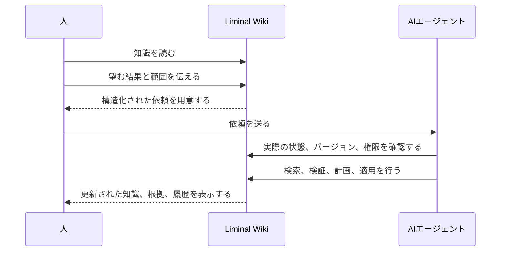

# Liminal Wiki

[English](README.md) · [한국어](README.ko.md) · [日本語](README.ja.md) ·
[简体中文](README.zh-CN.md)

## 編集ではなく、依頼で更新するWiki

**人が判断し、エージェントが管理する。**

Liminal Wikiは、エージェントが管理するプライベートWikiです。ページを読み、
何を変えるべきか伝えると、AIエージェントが実際のWikiを調べ、根拠を確認し、
許可された範囲で現在のバージョンに沿った変更を行います。

**結果は別のチャット回答ではなく、実際のWikiに残ります。**

[ライブデモを試す](https://liminal-wiki-webmcp.epinfomax.chatgpt.site/) ·
[基本の使い方](#基本の使い方) · [技術ガイド](docs/TECHNICAL_GUIDE.md)

> ChatGPTで初めてサインインすると、非公開の個人Wikiが自動的に作成されます。

<!-- 12〜20秒のデモを録画した後、この画像を docs/assets/liminal-wiki-demo.gif に置き換えます。 -->


_結果を依頼し、管理された信頼できる情報源を確認する。_

## 一つの依頼から、管理された知識へ

打ち上げ直後のナンシー・グレース・ローマン宇宙望遠鏡のページを開いたとします。
内容は二文だけで、装置、サーベイ、公開データ、科学的な問いのつながりはまだ
整理されていません。

エディターを開く代わりに、望む結果を依頼します。

```text
ナンシー・グレース・ローマン宇宙望遠鏡の打ち上げについてWikiページを作って
ください。いつ打ち上げられ、今どこへ向かい、何を研究するのか、次に何が起こる
のかを、添付した出典を使って分かりやすく説明してください。
```

エージェントは次の作業を行います。

- 開いているWikiと公式資料を確認する。
- 実際のWikiにRomanの打ち上げページを作る。
- 原典と関連ページをつなぐ。
- 追加の質問に応じて同じWikiを更新する。
- 結果と変更履歴を一か所に残す。

人が確認するのは、チャットからコピー待ちの文章ではなく、管理済みの知識です。

## AIエディターではない。エージェントを中心に再設計したWiki

多くのAI知識ツールは、既存のエディターにアシスタントを追加します。AIが下書き
しても、信頼できる情報源を維持する仕事は人に残ります。

Liminal Wikiは、基本となる操作そのものを変えます。

| 方式             | 結果が残る場所           | 知識の原本を管理する主体           |
| ---------------- | ------------------------ | ---------------------------------- |
| 文書とのチャット | チャット回答             | 人                                 |
| エディター内のAI | エディター内の下書き     | 人                                 |
| **Liminal Wiki** | **実際のWikiと変更履歴** | **人が許可した範囲のエージェント** |

閲覧画面には汎用の編集ボタンがありません。通常の知識作業では、依頼そのものが
書き込みインターフェースです。

## 基本の使い方

1. WebMCP対応ホストで
   [ライブデモ](https://liminal-wiki-webmcp.epinfomax.chatgpt.site/)を開き、
   ChatGPTでサインインします。
2. ページまたはWiki全体を対象に**変更を依頼**を選び、何を変えるべきか説明します。
3. 用意された依頼をAIエージェントに送り、必要なら出典ファイルを添付します。
4. Wikiに戻り、更新されたページ、根拠、つながり、変更履歴を確認します。

Markdownを直接編集したり、ツール名を覚えたり、知識構造を手作業で修復したり
する必要はありません。

## そのまま使える依頼例

### 会議メモを持続する知識にする

```text
この会議メモを意思決定ページにしてください。既存のプロジェクト情報を再利用し、
決定事項と未解決の問いを分け、裏付けとなる資料をリンクしてください。
```

### 古くなったページを修復する

```text
このページが現在も正確か確認してください。確認できた情報は更新し、関連する
意思決定の履歴は残し、検証できない主張には印を付けてください。
```

### 散らばった知識をつなぐ

```text
このトピックに関係するページを探して不足しているつながりを追加し、根拠に
支えられた結論、対立点、未解決の問いをまとめてください。
```

### 重複ページをまとめる

```text
このテーマの重複ページを探し、有用な知識を一つの正規ページに統合して、
参照リンクを修復してください。以前の内容は復元できる状態で残してください。
```

### 不確実性を隠さず調査する

```text
このページを追加調査して補足してください。見える根拠に支えられた主張だけを
追加し、不確かな点や意見が分かれる点は明確に示してください。
```

## 仕組み



人は意図と判断を担い、エージェントはその意図を安全な変更に変えるための
メンテナンスを担います。

## 実際の知識に使える安全性

Liminal Wikiでは、制御と復旧が通常の操作に組み込まれています。

- すべての依頼に対象と許可範囲が明記される。
- エージェントは変更前に実際の状態を確認する。
- 書き込み操作は現在のバージョンを確認する。
- 裏付けのない主張や矛盾を、黙って事実として書き換えない。
- 変更は履歴に残り、復元できる。
- メンバー、アクセス権、バックアップは人が直接管理する。

サインインしたアカウントごとに分離された個人Wikiが作成されます。ownerは、
互いの個人スペースを公開せずに、他のChatGPTアカウントを`viewer`または
`editor`として追加できます。

## メンテナンスではなく、結果を読む

エージェントの作業後は、同じ知識を次の画面から確認できます。

- **Documents**：フォルダー構成と正規のMarkdownページ
- **Explore topics**：結論、対立点、示唆、問い
- **Find**：タイトルと本文の検索
- **Connections**：ページ間の関係
- **Settings & backup**：メンバー、アクセス権、Wiki、復旧

画面は英語、韓国語、日本語、中国語（簡体字）に対応しています。

## WebMCPが製品を変える理由

WebMCPがなければ、エージェントは文章を提案するか、画面から操作を推測するか、
別の自動化アカウントを使うことになります。結果はサインイン中の知識原本から
切り離されがちです。

WebMCPを使うと、Liminal Wikiは現在のセッションとページに合った操作を、
開いている製品を扱うエージェントに提供できます。エージェントは現在のWikiを
確認し、権限とバージョンを守りながら、人が読んでいる同じ空間に変更を適用します。

WebMCPは従来のWikiにAIボタンを追加するためのものではありません。依頼そのものを
通常の知識管理インターフェースにできます。

製品は特定のエージェントに依存しません。必要なページスコープWebMCPに対応する
ホストであれば、サインイン中のセッションに許可されたツールを検出して
呼び出せます。

## 開発者と審査員向け

- [技術ガイド](docs/TECHNICAL_GUIDE.md)：アクセスモデル、WebMCPの動作、
  安全性、アーキテクチャ、ローカル実行、検証
- [システム設計](docs/SYSTEM_DESIGN.md)：契約、運用、復旧、検証根拠
- [Challenge提出文とデモ台本](docs/WEBMCP_CHALLENGE.md)
- [本番Siteガイド](site/README.md)
- [復旧ランブック](site/RECOVERY_RUNBOOK.md)
- [出典とライセンスの記録](docs/SOURCE_PROVENANCE.md)

## ライセンス

Liminal Wikiのオリジナルコードと、このリポジトリで作成した変更は
[GPL-3.0-only](LICENSE)で提供されます。第三者の著作物には、それぞれの
ライセンスが適用されます。詳しくは[出典の記録](docs/SOURCE_PROVENANCE.md)と
[第三者向け通知](site/THIRD_PARTY_NOTICES.md)をご覧ください。
