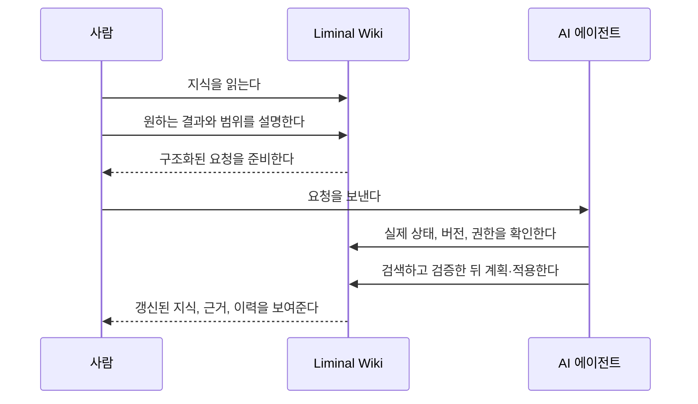

# Liminal Wiki

[English](README.md) · [한국어](README.ko.md) · [日本語](README.ja.md) ·
[简体中文](README.zh-CN.md)

## 편집하지 않고, 요청으로 업데이트하는 위키

**사람은 판단하고, 에이전트는 관리합니다.**

Liminal Wiki는 에이전트가 관리하는 비공개 위키입니다. 문서를 읽고 무엇이
달라져야 하는지 말하면, AI 에이전트가 실제 위키를 살펴보고 근거를 확인한 뒤,
허용된 범위 안에서 현재 버전에 맞게 변경합니다.

**결과는 또 하나의 채팅 답변이 아니라 실제 위키에 남습니다.**

[라이브 데모 체험](https://liminal-wiki-webmcp.epinfomax.chatgpt.site/) ·
[핵심 사용 흐름](#핵심-사용-흐름) · [기술 가이드](docs/TECHNICAL_GUIDE.md)

> ChatGPT로 처음 로그인하면 비공개 개인 위키가 자동으로 만들어집니다.

<!-- 12~20초 데모를 녹화한 뒤 이 이미지를 docs/assets/liminal-wiki-demo.gif로 교체합니다. -->


_결과를 요청하고, 관리된 지식 원본을 검토하세요._

## 한 번의 요청, 관리되는 지식 원본

막 발사된 낸시 그레이스 로먼 우주망원경 문서를 열었다고 생각해 보세요. 내용은
두 문장뿐이고, 장비와 관측 프로그램, 공개 데이터, 과학 질문이 어떻게 연결되는지는
아직 정리되지 않았습니다.

편집기를 여는 대신 원하는 결과를 요청합니다.

```text
낸시 그레이스 로먼 우주망원경 발사 위키를 만들어 주세요. 언제 발사됐고, 지금
어디로 가고 있으며, 무엇을 연구할지와 다음 일정을 첨부한 출처를 사용해 쉽게
설명해 주세요.
```

에이전트는 다음 작업을 수행합니다.

- 열린 위키와 공식 출처 자료를 확인합니다.
- 실제 위키에 Roman 발사 문서를 만듭니다.
- 원래 출처와 관련 문서를 연결합니다.
- 추가 질문을 하면 같은 위키를 보강합니다.
- 결과와 변경 기록을 한곳에 남깁니다.

사람은 채팅에서 다시 복사해야 할 글이 아니라, 관리가 끝난 지식을 검토합니다.

## AI 편집기가 아니라, 에이전트를 중심으로 다시 설계한 위키

대부분의 AI 지식 도구는 기존 편집기에 도우미를 추가합니다. AI가 초안을 써줘도
지식 원본을 관리하는 일은 여전히 사람에게 남습니다.

Liminal Wiki는 기본 상호작용 자체를 바꿉니다.

| 방식             | 결과가 남는 곳            | 지식 원본을 관리하는 주체         |
| ---------------- | ------------------------- | --------------------------------- |
| 문서와 채팅하기  | 채팅 답변                 | 사람                              |
| 편집기 안의 AI   | 편집기 안의 초안          | 사람                              |
| **Liminal Wiki** | **실제 위키와 변경 이력** | **사람이 허용한 범위의 에이전트** |

읽기 화면에는 범용 수정 버튼이 없습니다. 일반 지식 작업에서는 요청이 곧 쓰기
인터페이스입니다.

## 핵심 사용 흐름

1. WebMCP를 지원하는 호스트에서
   [라이브 데모](https://liminal-wiki-webmcp.epinfomax.chatgpt.site/)를 열고
   ChatGPT로 로그인합니다.
2. 문서 또는 위키 전체를 대상으로 **변경 요청**을 선택하고, 무엇이 달라져야
   하는지 설명합니다.
3. 준비된 요청을 AI 에이전트에 보내고, 필요하면 출처 파일을 첨부합니다.
4. 위키로 돌아와 갱신된 문서와 연결된 근거, 관계, 변경 기록을 검토합니다.

Markdown을 직접 고치거나 도구 이름을 외우거나 지식 구조를 손으로 복구할 필요가
없습니다.

## 이런 요청을 바로 사용해 보세요

### 회의 메모를 지속되는 지식으로

```text
이 회의 메모를 의사결정 문서로 만들어 주세요. 기존 프로젝트 맥락을 재사용하고,
결정 사항과 미해결 질문을 나누고, 근거 자료를 연결해 주세요.
```

### 오래된 문서 점검하기

```text
이 문서가 아직 정확한지 확인해 주세요. 검증된 정보는 갱신하고, 관련 의사결정
이력은 보존하며, 확인할 수 없는 주장은 표시해 주세요.
```

### 흩어진 지식 연결하기

```text
이 주제와 관련된 문서를 찾아 빠진 연결을 추가하고, 근거가 뒷받침하는 결론과
상충점, 열린 질문을 정리해 주세요.
```

### 중복 문서 정리하기

```text
이 주제의 중복 문서를 찾아 유용한 지식을 하나의 정본 문서로 합치고, 들어오는
링크를 고친 뒤, 이전 내용은 복구할 수 있게 유지해 주세요.
```

### 불확실성을 숨기지 않고 조사하기

```text
이 문서를 추가 조사해 보완해 주세요. 보이는 근거가 뒷받침하는 주장만 추가하고,
불확실하거나 의견이 갈리는 내용은 명확하게 밝혀 주세요.
```

## 작동 방식



사람은 의도와 판단을 맡고, 에이전트는 그 의도를 안전한 변경으로 만드는
유지보수를 맡습니다.

## 실제 지식에 사용할 수 있는 통제와 안전장치

Liminal Wiki는 통제와 복구를 일상적인 사용 흐름에 포함합니다.

- 모든 요청에는 대상과 허용 범위가 명시됩니다.
- 에이전트는 변경 전에 실제 상태를 확인합니다.
- 쓰기 작업은 현재 버전을 확인합니다.
- 근거가 없거나 상충하는 주장을 몰래 사실로 바꾸지 않습니다.
- 변경은 이력에 남고 복구할 수 있습니다.
- 멤버, 접근 권한과 백업은 사람이 직접 관리합니다.

로그인한 계정마다 격리된 개인 위키가 만들어집니다. owner는 서로의 개인 공간을
노출하지 않고 다른 ChatGPT 계정을 `viewer` 또는 `editor`로 추가할 수 있습니다.

## 유지보수 대신 결과를 읽으세요

에이전트의 작업이 끝나면 같은 지식을 다음 화면에서 검토할 수 있습니다.

- **Documents**: 폴더 구조와 정본 Markdown 문서
- **Explore topics**: 결론, 상충점, 시사점과 질문
- **Find**: 제목과 내용 검색
- **Connections**: 문서 사이의 관계
- **Settings & backup**: 멤버, 접근 권한, 위키와 복구

화면은 영어, 한국어, 일본어, 중국어 간체를 지원합니다.

## WebMCP가 제품을 바꾸는 이유

WebMCP가 없다면 에이전트는 글을 제안하거나 화면을 보고 추측하거나 별도의 자동화
계정을 사용해야 합니다. 결과도 로그인된 지식 원본과 분리되기 쉽습니다.

WebMCP를 사용하면 Liminal Wiki는 현재 세션과 페이지에 맞는 작업을, 열린 제품을
사용 중인 에이전트에게 제공합니다. 에이전트는 현재 위키를 직접 확인하고 권한과
버전을 지키며, 사람이 읽고 있는 같은 공간에 요청된 변경을 적용할 수 있습니다.

WebMCP는 기존 위키에 AI 버튼을 더하는 기술이 아닙니다. 요청 자체를 일상적인 지식
관리 인터페이스로 만들 수 있게 합니다.

제품은 특정 에이전트에 종속되지 않습니다. 필요한 page-scoped WebMCP를 지원하는
호환 호스트라면 로그인 세션에 허용된 도구를 발견하고 호출할 수 있습니다.

## 개발자와 심사위원을 위한 문서

- [기술 가이드](docs/TECHNICAL_GUIDE.md): 접근 모델, WebMCP 동작, 안전성,
  아키텍처, 로컬 실행과 검증
- [시스템 설계](docs/SYSTEM_DESIGN.md): 계약, 운영, 복구와 검증 근거
- [Challenge 제출 원고와 데모 대본](docs/WEBMCP_CHALLENGE.md)
- [프로덕션 Site 가이드](site/README.md)
- [복구 런북](site/RECOVERY_RUNBOOK.md)
- [출처와 라이선스 기록](docs/SOURCE_PROVENANCE.md)

## 라이선스

Liminal Wiki의 원본 코드와 저장소에서 작성한 수정 사항은
[GPL-3.0-only](LICENSE)로 배포됩니다. 제3자 저작물에는 각 저작물의 라이선스가
유지됩니다. 자세한 내용은 [출처 기록](docs/SOURCE_PROVENANCE.md)과
[제3자 고지](site/THIRD_PARTY_NOTICES.md)를 확인하세요.
