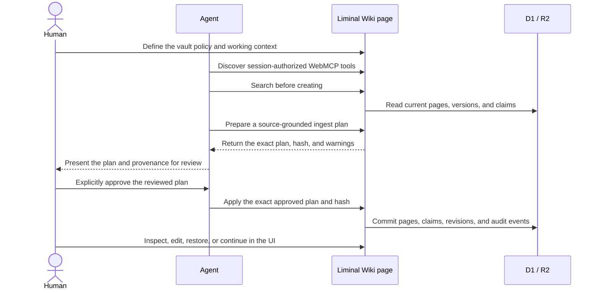
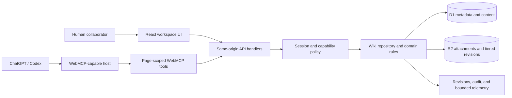

# Liminal Wiki

**A source-grounded knowledge workspace where humans and AI agents share the
same tools, permissions, revisions, and provenance through WebMCP.**

[System design](docs/SYSTEM_DESIGN.md) ·
[WebMCP Challenge](https://webmcp.devpost.com/)

> Live app: <https://liminal-wiki-webmcp.epinfomax.chatgpt.site/>.
> The URL is publicly reachable, but every workspace and API requires ChatGPT
> sign-in. Wiki data is private to the signed-in account's memberships.


## Account access and ownership

ChatGPT sign-in is mandatory. On the first signed-in visit, an account that has
no existing membership receives its own deterministic, isolated `Liminal Wiki`
vault and becomes its owner. Returning with the same account reopens that
workspace; another account receives a different vault and cannot discover the
first account's content.

Every account uses the production wiki product with persistent storage, the
normal role model, the full owner WebMCP catalog, revisions, provenance,
backups, and recovery features. There is no separate trial mode or temporary
workspace. Existing memberships and vaults are preserved. Restricted isolated
workspaces created under the earlier policy are upgraded in place to personal
owner vaults on their next signed-in session, retaining their pages and history.

In short, **public** describes who may reach the ChatGPT sign-in boundary. Data
access still comes from the signed-in account's isolated membership; it never
grants anonymous or cross-vault access.

## The problem

Knowledge tools usually make people choose between two weak forms of AI
assistance: an agent guesses its way through a visual interface, or a separate
automation backend bypasses the application's permissions and state. Both
approaches make collaboration brittle. The agent can act on stale content,
overwrite a teammate's work, lose source attribution, or perform operations the
current user cannot safely review.

Liminal Wiki makes the open web application itself the collaboration surface.
The page exposes precise, structured WebMCP tools that use its current vault,
signed-in session, selected page, permissions, and server-side rules. Humans
stay in the workspace; agents work through the same command layer.

## The human-agent collaboration loop



One representative flow is:

1. The agent calls `wiki_get_context` and `wiki_get_operating_contract` to
   understand the active vault and its policy.
2. It uses `wiki_search`, `wiki_get_page`, and `wiki_get_claims` to avoid
   duplicates and preserve existing knowledge.
3. It creates an expiring source-grounded plan with `wiki_plan_ingest`.
4. The agent presents the proposed source, pages, claims, confidence, and
   warnings to a person for explicit review.
5. The agent calls `wiki_apply_ingest` with the unchanged plan hash and
   explicit approval.
6. Both participants inspect the committed revisions and run `wiki_lint` to
   find missing provenance, unresolved links, or stale claims.

This is not a remote MCP server. The tools are page-scoped: they exist while
the Site is open and intentionally reuse the page's origin, state, and current
login session.

## Why WebMCP matters here

| Without structured page tools                | With Liminal Wiki WebMCP                           |
| -------------------------------------------- | -------------------------------------------------- |
| Infer actions from screenshots and DOM state | Discover explicit tools with closed JSON Schemas   |
| Maintain a separate automation identity      | Use the signed-in page session and role            |
| Risk writing against stale content           | Require the latest `expected_version`              |
| Retry mutations and create duplicates        | Replay safe operations with `operation_id`         |
| Generate prose without durable evidence      | Store source metadata and claim-level provenance   |
| Hide changes behind an agent transcript      | Create immutable revisions and audit events        |
| Expose every action to every caller          | Project the tool catalog from current capabilities |

The result is a coherent product experience for both participants rather than
a UI with an automation layer bolted on afterward.

## WebMCP surface

Liminal Wiki can expose up to 22 tools. The exact catalog changes with the
current session's capabilities and active vault.

| Area                 | Tools                                                                                                                                    | What they enable                                                                       |
| -------------------- | ---------------------------------------------------------------------------------------------------------------------------------------- | -------------------------------------------------------------------------------------- |
| Context and vaults   | `wiki_get_context`, `wiki_list_vaults`, `wiki_switch_vault`, `wiki_create_vault`                                                         | Discover and change the page-scoped working context                                    |
| Policy and grounding | `wiki_get_operating_contract`, `wiki_update_operating_contract`, `wiki_get_claims`, `wiki_lint`, `wiki_plan_ingest`, `wiki_apply_ingest` | Define knowledge policy, review grounded changes, preserve evidence, and audit quality |
| Browse               | `wiki_list_pages`, `wiki_search`, `wiki_get_page`, `wiki_get_neighbors`, `wiki_list_revisions`                                           | Traverse hierarchy, search bounded content, follow links, and inspect history          |
| Author               | `wiki_create_folder`, `wiki_create_page`, `wiki_update_page`, `wiki_append_page`, `wiki_move_page`, `wiki_link_pages`                    | Maintain Markdown knowledge without bypassing domain rules                             |
| Recover              | `wiki_restore_revision`                                                                                                                  | Restore an immutable snapshot as a new version                                         |

Soft delete is intentionally UI/API-only until a typed-confirmation WebMCP
contract is ready. The absence of a destructive tool is a product safety
decision, not a missing capability.

## Safety by construction

- **Capability-aware discovery.** The page fetches trusted same-origin session
  capabilities and registers only the tools the current user may invoke.
- **Server-side authorization.** Conditional registration improves discovery;
  every API handler independently enforces the same permission.
- **Closed, bounded inputs.** Tool schemas reject unknown top-level fields and
  set explicit bounds. Executors validate inputs again before calling an API.
- **Optimistic concurrency.** Existing-page writes require
  `expected_version`, so a stale agent cannot silently overwrite newer work.
- **Safe retries.** Mutations use client-generated operation UUIDs where the
  contract promises idempotency.
- **Review before apply.** Source-grounded ingest separates planning from an
  explicitly approved, hash-matched application step.
- **Recoverable history.** Successful changes create immutable revisions;
  restoration creates another revision rather than rewriting history.
- **Untrusted content boundaries.** Returned Markdown and evidence fragments
  are labeled as user content, not agent instructions.
- **Content-free telemetry.** WebMCP observability records bounded outcome,
  latency, tool name, and safe correlation data—not prompts, page bodies,
  credentials, or tool results.
- **Operational containment.** Owner-controlled read-only mode hides WebMCP
  mutations, disables human write controls, and rejects direct mutation APIs.

## A complete knowledge workspace

The human interface and WebMCP tools operate on the same product, not parallel
implementations. The workspace includes:

- multiple vaults with physical folder/page hierarchy and per-user switching;
- Markdown editing with GFM, math, Mermaid, autosave, and conflict handling;
- full-text search, backlinks, graph exploration, and stable page permalinks;
- source pages, structured retrieval metadata, claim-level provenance, and
  knowledge-quality linting;
- immutable revisions, restore-as-new-version, leaf soft delete, and trash
  recovery;
- attachment upload, checksum verification, quota accounting, and R2 storage;
- portable and full multipart backups with per-part SHA-256 and resumable
  empty-Site restore;
- member roles, ownership transfer, audit history, repair diagnostics, storage
  maintenance, and operational read-only mode.

## Architecture



The client registers tools after mount with
`document.modelContext.registerTool()`, guards browsers without WebMCP, and
uses an abort signal to clean up registrations. Tool executors remain thin and
delegate persistence to ordinary testable same-origin handlers.

## Technology

| Layer             | Choice                                                        |
| ----------------- | ------------------------------------------------------------- |
| Hosting           | ChatGPT Sites                                                 |
| Web runtime       | Next.js-compatible vinext on Vite and Cloudflare Workers      |
| UI                | React 19, Base UI, Sigma/Graphology, Mermaid, KaTeX           |
| Data              | Cloudflare D1 through Drizzle ORM                             |
| Objects           | Cloudflare R2                                                 |
| Agent integration | Page-scoped WebMCP via `document.modelContext.registerTool()` |
| Validation        | TypeScript, ESLint, Prettier, Vitest, Playwright, axe-core    |

## Run locally

Requirements:

- Node.js 22.13 or newer
- npm

```bash
git clone https://github.com/rca32/llmwiki-webmcp.git
cd llmwiki-webmcp/site
npm ci
npm run dev
```

The ChatGPT Sites development runtime supplies local D1/R2 bindings and a test
identity. Production does not accept the local identity adapter. See
[`site/.env.example`](site/.env.example) for the small local configuration
surface.

## Validate the application

Static contracts and the production build:

```bash
cd site
npm run format:check
npm run lint
npm run typecheck
npm test
npm run test:notices
npm run db:check
npm run build
npm run test:bundle
```

Browser, scale, and recovery gates:

```bash
npm run test:ui:ci
npm run test:performance:ci
npm run test:backup-roundtrip
npm run test:backup-spike
```

WebMCP acceptance is a separate host-level step. A successful build or the
presence of registration code is not enough:

1. Copy the URL generated for the current ChatGPT Sites deployment and open it
   in a supported ChatGPT/Codex browser host.
2. Acquire the host's WebMCP capability and run `fetchTools()`.
3. Inspect the discovered names, descriptions, schemas, and annotations.
4. Call a harmless read tool such as `wiki_get_context`.
5. Re-discover after a role, vault, login, or operational mode change.

The production acceptance discovered the full 22-tool catalog projected for
the signed-in personal-vault owner role and completed the scripted
context → contract → search → plan → apply → claims/revisions/lint flow. It
created one source page, one entity page, and one grounded claim; the resulting
quality check reported no issues. Destructive owner operations were discovered
but deliberately not exercised. A hosted viewer-only comparison remains a
separate acceptance gate.

## Repository map

```text
.
├── site/                         # Production ChatGPT Site
│   ├── app/site-tools.tsx        # WebMCP descriptors and executors
│   ├── app/api/                  # Shared same-origin command/query surface
│   ├── db/                       # D1 schema and repository invariants
│   ├── lib/                      # Contracts, validation, safety, and packaging
│   └── tests/                    # Browser, performance, bundle, and DR gates
├── recovery-site/                # Isolated recovery validation Site
├── skills/llm-wiki-domain/       # Source-grounded wiki Agent Skill
└── docs/SYSTEM_DESIGN.md         # Architecture and acceptance evidence
```

## Built for the WebMCP Challenge

Liminal Wiki was created during the 2026 WebMCP Challenge submission period.
Its submission focuses on the four judging dimensions:

- **WebMCP leverage:** a non-trivial, session-aware 22-tool catalog grounded in
  real page state and application permissions;
- **execution:** one complete UI/API/WebMCP product with persistence,
  observability, tests, backup, and recovery;
- **potential impact:** safer research and knowledge maintenance for teams that
  need durable sources and accountable changes;
- **creativity and ambition:** an operating contract and plan-review-apply
  workflow that make human judgment part of the agent protocol.

Official challenge information is available from the
[OpenAI WebMCP Challenge](https://openai.com/ko-KR/webmcp-challenge/) and
[Devpost](https://webmcp.devpost.com/).

## Documentation

- [System design](docs/SYSTEM_DESIGN.md): architecture, security, contracts,
  operations, performance, recovery, and acceptance evidence
- [Production Site guide](site/README.md): detailed local and operational test
  commands
- [Recovery runbook](site/RECOVERY_RUNBOOK.md): rollback, revision recovery,
  and full-Site restoration
- [Source provenance](docs/SOURCE_PROVENANCE.md): pinned origins,
  file-by-file adaptation records, exclusions, and license handling

## License and provenance

Except where a file or third-party notice states otherwise, all original
Liminal Wiki source code and repository-owned modifications are licensed under
[`GPL-3.0-only`](LICENSE). Third-party dependencies and separately attributed
works retain their respective licenses. Pinned origins, adapted files,
modifications, exclusions, and non-import declarations are consolidated in
[source provenance](docs/SOURCE_PROVENANCE.md). Direct dependency licenses are
listed in [third-party notices](site/THIRD_PARTY_NOTICES.md).
