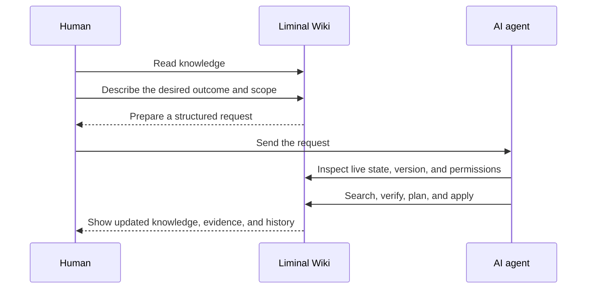

# Liminal Wiki

[English](README.md) · [한국어](README.ko.md) · [日本語](README.ja.md) ·
[简体中文](README.zh-CN.md)

## The wiki you update by asking—not editing.

**People decide. Agents maintain.**

Liminal Wiki is a private, agent-maintained wiki. Read a page, tell it what
should be different, and let an AI agent inspect the live wiki, check the
evidence, and make a scoped, version-aware change.

**The result lives in the wiki—not in another chat transcript.**

[Try the live demo](https://liminal-wiki-webmcp.epinfomax.chatgpt.site/) ·
[See the core interaction](#see-the-core-interaction) ·
[Technical guide](docs/TECHNICAL_GUIDE.md)

> A private personal wiki is created automatically on first ChatGPT sign-in.

<!-- Replace this screenshot with docs/assets/liminal-wiki-demo.gif after recording the 12–20 second walkthrough. -->


_Ask for an outcome. Review a maintained source of truth._

## One request. A maintained source of truth.

Imagine opening a two-sentence page about the newly launched Nancy Grace Roman
Space Telescope. It records the launch, but not how the instruments, surveys,
public data, and scientific questions fit together.

Instead of opening an editor, request the result you want:

```text
Create a wiki page about the launch of the Nancy Grace Roman Space Telescope.
Explain when it launched, where it is going, what it will study, and what
happens next. Use the attached sources and make it easy to understand.
```

The agent then:

- checks the open wiki and the official source packet;
- creates the Roman launch page in the live wiki;
- links the sources and related pages;
- updates the same wiki when you ask a follow-up question;
- keeps the result and its revision history in one place.

You review maintained knowledge—not a block of text waiting to be copied out of
chat.

## Not an AI editor. A wiki redesigned around agents.

Most AI knowledge tools add an assistant to an existing editor. The assistant
may draft text, but people still have to maintain the source of truth.

Liminal Wiki changes the primary interaction.

| Approach         | Where the result ends up          | Who maintains the source of truth       |
| ---------------- | --------------------------------- | --------------------------------------- |
| Chat with docs   | A chat response                   | A person                                |
| AI in an editor  | A draft inside the editor         | A person                                |
| **Liminal Wiki** | **The live wiki and its history** | **An agent, within the approved scope** |

There is no general-purpose Edit button in the reading interface. For routine
knowledge work, the request is the write interface.

## See the core interaction

1. Open the [live demo](https://liminal-wiki-webmcp.epinfomax.chatgpt.site/) in
   a host with WebMCP support and sign in with ChatGPT.
2. Open a page—or target the whole wiki—then select **Request change** and
   describe what should be different.
3. Send the prepared request to your AI agent, attaching a source file when
   needed.
4. Return to the wiki and review the updated page, linked evidence,
   connections, and revision history.

You do not need to edit Markdown, remember tool names, or manually repair the
knowledge structure.

## Try one of these requests

### Turn notes into durable knowledge

```text
Turn these meeting notes into a decision page. Reuse existing project context,
separate decisions from unresolved questions, and link the supporting sources.
```

### Repair an outdated page

```text
Check whether this page is still accurate. Update confirmed information,
preserve relevant decision history, and flag claims that cannot be verified.
```

### Connect scattered knowledge

```text
Find pages related to this topic, add the missing connections, and summarize
the conclusions, tensions, and open questions supported by the evidence.
```

### Consolidate duplicates

```text
Find duplicate pages about this subject, merge the useful knowledge into one
canonical page, repair incoming links, and keep the old content recoverable.
```

### Research without hiding uncertainty

```text
Research and expand this page. Add only claims supported by visible evidence
and clearly identify anything that remains uncertain or contested.
```

## How it works



The human remains responsible for intent and judgment. The agent handles the
maintenance work required to turn that intent into a safe change.

## Safe enough for real knowledge

Liminal Wiki treats control and recovery as part of the normal interaction:

- every request identifies its target and authorized scope;
- the agent inspects the live state before changing it;
- write operations check the current version;
- unsupported or conflicting claims are not silently rewritten as fact;
- changes remain visible in revision history and can be recovered;
- wiki membership, access, and backups remain under direct human control.

Each signed-in account starts with an isolated private wiki. Owners can later
add other ChatGPT accounts as viewers or editors without exposing anyone's
separate personal workspace.

## Read the result, not the maintenance work

After an agent completes a change, the same knowledge can be reviewed through:

- **Documents** for the folder tree and canonical Markdown pages;
- **Explore topics** for conclusions, tensions, implications, and questions;
- **Find** for title and content search;
- **Connections** for relationships between pages;
- **Settings & backup** for people, access, wikis, and recovery.

The interface is available in English, Korean, Japanese, and Simplified
Chinese.

## Why WebMCP changes the product

Without WebMCP, an agent can suggest text, guess from screenshots, or operate a
separate automation account. The result often remains disconnected from the
signed-in source of truth.

With WebMCP, Liminal Wiki exposes session-aware, page-scoped operations to the
agent working with the open product. The agent can inspect the current wiki,
respect its permissions and versions, and apply the requested change directly
to the same workspace the person is reading.

WebMCP is not an AI button added to a conventional wiki. It enables the request
itself to become the normal maintenance interface.

The product is not tied to one agent. Any compatible host with the required
page-scoped WebMCP support can discover and call the tools available to its
signed-in session.

## For builders and judges

- [Technical guide](docs/TECHNICAL_GUIDE.md): access, WebMCP behavior, safety,
  architecture, local setup, and validation
- [System design](docs/SYSTEM_DESIGN.md): contracts, operations, recovery, and
  acceptance evidence
- [Challenge submission and demo script](docs/WEBMCP_CHALLENGE.md)
- [Production Site guide](site/README.md)
- [Recovery runbook](site/RECOVERY_RUNBOOK.md)
- [Source provenance](docs/SOURCE_PROVENANCE.md)

## License

Original Liminal Wiki code and repository-owned modifications are licensed
under [GPL-3.0-only](LICENSE). Third-party works retain their respective
licenses; see [source provenance](docs/SOURCE_PROVENANCE.md) and
[third-party notices](site/THIRD_PARTY_NOTICES.md).
