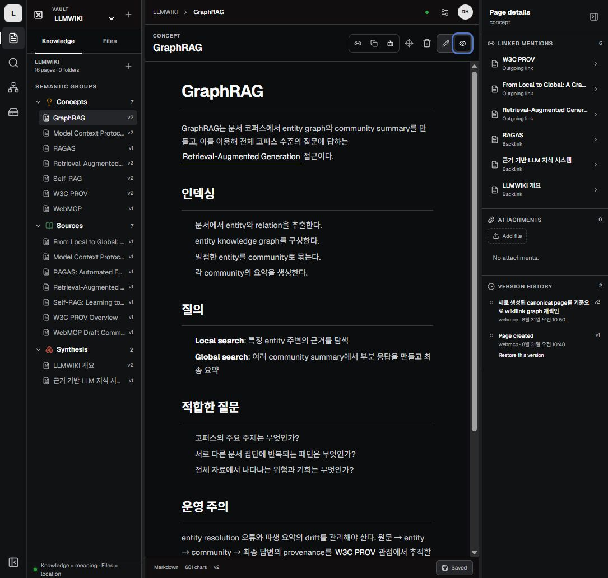
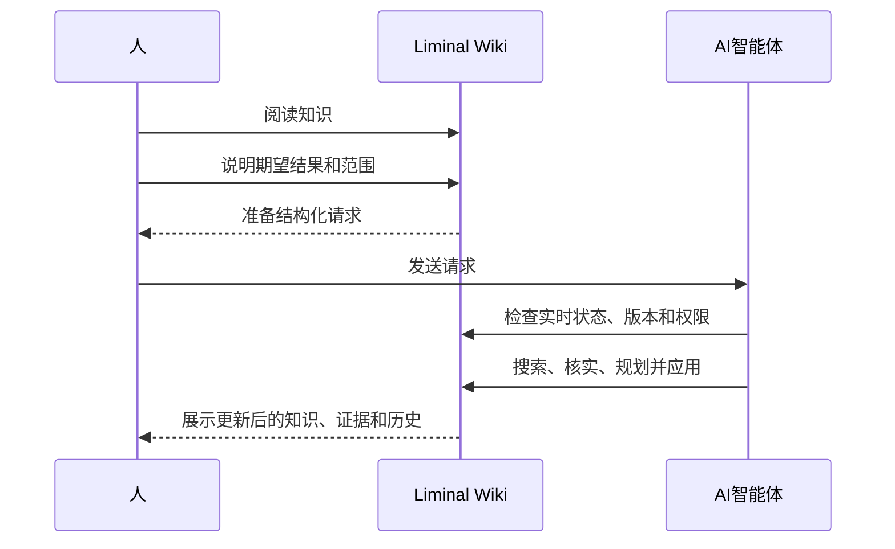

# Liminal Wiki

[English](README.md) · [한국어](README.ko.md) · [日本語](README.ja.md) ·
[简体中文](README.zh-CN.md)

## 不用编辑，提出请求就能更新的 Wiki

**人负责判断，智能体负责维护。**

Liminal Wiki 是一个由智能体维护的私密 Wiki。阅读页面并说明哪里需要改变，
AI 智能体就会检查实时 Wiki、核对证据，并在授权范围内根据当前版本进行更改。

**结果会留在真实的 Wiki 中，而不是变成另一段聊天记录。**

[体验在线演示](https://liminal-wiki-webmcp.epinfomax.chatgpt.site/) ·
[查看核心操作](#查看核心操作) · [技术指南](docs/TECHNICAL_GUIDE.md)

> 首次使用 ChatGPT 登录时，系统会自动创建一个私密的个人 Wiki。

<!-- 录制 12–20 秒演示后，将此图片替换为 docs/assets/liminal-wiki-demo.gif。 -->



_请求一个结果，审阅经过维护的可靠知识源。_

## 一次请求，得到持续维护的知识源

假设你打开刚刚发射的南希·格蕾丝·罗曼空间望远镜页面。页面只有两句话，仪器、
巡天、公开数据与科学问题之间的关系都还没有整理进去。

你不必打开编辑器，只需描述想要的结果：

```text
请创建一个关于南希·格蕾丝·罗曼空间望远镜发射的 Wiki 页面。使用附上的来源，
用简单易懂的方式说明它何时发射、现在飞往哪里、将研究什么，以及接下来会发生
什么。
```

智能体随后会：

- 检查当前打开的 Wiki 和官方来源资料；
- 在真实 Wiki 中创建 Roman 发射页面；
- 连接原始来源和相关页面；
- 在用户提出后续问题时更新同一个 Wiki；
- 将结果和修改历史保存在一个地方。

用户审阅的是已经维护好的知识，而不是一段还要从聊天窗口复制出去的文字。

## 不是 AI 编辑器，而是围绕智能体重新设计的 Wiki

大多数 AI 知识工具只是在原有编辑器中加入一个助手。AI 可以生成草稿，但维护
可靠知识源的工作仍然留给人。

Liminal Wiki 改变了最基本的交互方式。

| 方式             | 结果存放的位置           | 维护知识原本的主体           |
| ---------------- | ------------------------ | ---------------------------- |
| 与文档聊天       | 一段聊天回答             | 人                           |
| 编辑器中的 AI    | 编辑器里的草稿           | 人                           |
| **Liminal Wiki** | **真实 Wiki 和修改历史** | **在人类授权范围内的智能体** |

阅读界面没有通用的“编辑”按钮。对于日常知识工作，请求本身就是写入界面。

## 查看核心操作

1. 在支持 WebMCP 的宿主中打开
   [在线演示](https://liminal-wiki-webmcp.epinfomax.chatgpt.site/)，并使用
   ChatGPT 登录。
2. 以页面或整个 Wiki 为目标，选择**请求更改**，说明哪里应该不同。
3. 把准备好的请求发送给 AI 智能体，需要时附上来源文件。
4. 返回 Wiki，审阅更新后的页面、关联证据、页面关系和修改历史。

你不需要编辑 Markdown、记住工具名称，也不需要手动修复知识结构。

## 可以直接尝试的请求

### 把会议记录变成持久知识

```text
请把这些会议记录整理成决策页面。复用已有的项目背景，区分已做出的决定和未解决
的问题，并链接支持材料。
```

### 修复过时页面

```text
请检查这个页面是否仍然准确。更新已确认的信息，保留相关决策历史，并标出无法
核实的说法。
```

### 连接分散的知识

```text
查找与这个主题相关的页面，补上缺失的关联，并总结证据所支持的结论、分歧和
待解决问题。
```

### 合并重复页面

```text
查找关于这个主题的重复页面，把有用知识合并到一个规范页面中，修复指向它们的
链接，并确保旧内容仍可恢复。
```

### 在研究中保留不确定性

```text
请研究并扩充这个页面。只添加有可见证据支持的说法，并清楚标出仍不确定或存在
争议的内容。
```

## 工作原理



人继续负责意图和判断。智能体负责把这种意图转化为安全更改所需的维护工作。

## 足以用于真实知识的安全与控制

Liminal Wiki 把控制和恢复放进日常操作中：

- 每个请求都明确目标和授权范围；
- 智能体在更改前检查实时状态；
- 写入操作检查当前版本；
- 没有依据或彼此冲突的说法不会被悄悄改写成事实；
- 更改保留在历史中，并且可以恢复；
- 成员、访问权限和备份继续由人直接管理。

每个登录账号都会获得一个相互隔离的个人 Wiki。owner 可以把其他 ChatGPT 账号
添加为 `viewer` 或 `editor`，而不会暴露任何人的独立个人空间。

## 阅读结果，而不是维护过程

智能体完成更改后，可以从以下位置审阅同一份知识：

- **Documents**：文件夹结构和规范 Markdown 页面；
- **Explore topics**：结论、分歧、启示和问题；
- **Find**：标题和正文搜索；
- **Connections**：页面之间的关系；
- **Settings & backup**：成员、访问权限、Wiki 和恢复。

界面支持英语、韩语、日语和简体中文。

## WebMCP 为什么会改变产品

没有 WebMCP 时，智能体只能建议文字、根据截图猜测操作，或者使用单独的自动化
账号。结果往往与当前登录的知识原本相互分离。

有了 WebMCP，Liminal Wiki 可以把与当前会话和页面对应的操作提供给正在使用该
产品的智能体。智能体能够检查当前 Wiki，遵守权限和版本，并把请求的更改直接
应用到用户正在阅读的同一个工作区。

WebMCP 不是给传统 Wiki 增加一个 AI 按钮。它让请求本身成为日常知识维护界面。

产品并不依赖某一个智能体。只要兼容宿主支持所需的页面级 WebMCP，就可以发现并
调用当前登录会话获准使用的工具。

## 面向开发者和评审

- [技术指南](docs/TECHNICAL_GUIDE.md)：访问模型、WebMCP 行为、安全性、
  架构、本地运行和验证
- [系统设计](docs/SYSTEM_DESIGN.md)：约束、运行、恢复和验收证据
- [Challenge 提交文案和演示脚本](docs/WEBMCP_CHALLENGE.md)
- [生产 Site 指南](site/README.md)
- [恢复手册](site/RECOVERY_RUNBOOK.md)
- [来源与许可证记录](docs/SOURCE_PROVENANCE.md)

## 许可证

Liminal Wiki 的原创代码和本仓库拥有的修改采用
[GPL-3.0-only](LICENSE) 许可证。第三方作品继续遵循各自的许可证。详情请参阅
[来源记录](docs/SOURCE_PROVENANCE.md)和
[第三方声明](site/THIRD_PARTY_NOTICES.md)。
