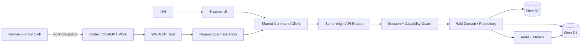
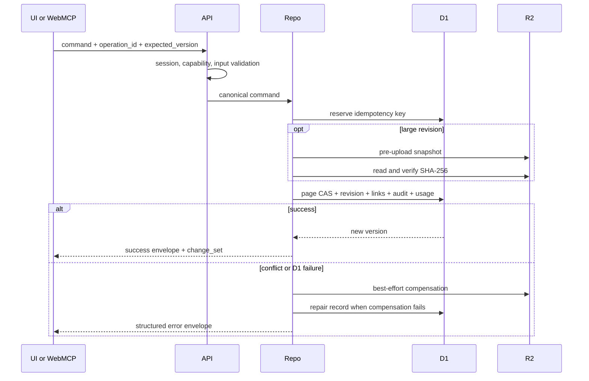
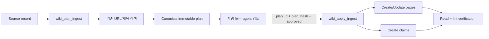

# Liminal Wiki 시스템 디자인

> 상태: 구현된 시스템의 살아 있는 설계 문서
>
> 최종 통합 검토: 2026-08-30
>
> 대상: `site`, `recovery-site`, page-scoped WebMCP, D1/R2 데이터 계층
>
> 기준 배포 기록: production Sites saved version 36
>
> 라이선스: `GPL-3.0-only`

## 1. 문서의 목적과 읽는 법

이 문서는 Liminal Wiki를 이해하고 변경하는 데 필요한 단일 시스템 설계 기준이다. 제품 의도, 런타임 경계, 데이터 모델, API와 WebMCP 계약, 지식 수집 흐름, 보안, 복구, 운영 및 검증 기준을 한곳에 정의한다.

이 문서는 과거의 개발 단계나 개정 순서를 설명하지 않는다. 현재 소스가 하나의 설계에서 구현되었다는 관점으로 시스템을 기술한다. 문서와 구현이 다르면 실행 중인 코드와 데이터 migration이 사실의 기준이며, 차이를 확인한 변경자는 같은 작업에서 이 문서를 갱신해야 한다.

운영 절차의 명령 수준 상세는 [`site/RECOVERY_RUNBOOK.md`](../site/RECOVERY_RUNBOOK.md), 업스트림 파일별 이식 기록은 [`site/docs/UPSTREAM_LLM_WIKI.md`](../site/docs/UPSTREAM_LLM_WIKI.md)에 둔다. 두 파일은 각각 실행용 런북과 라이선스 provenance이며, 시스템 설계를 분산시키는 별도 설계 문서가 아니다.

## 2. 제품 정의와 범위

Liminal Wiki는 ChatGPT Sites에 호스팅되는 source-grounded Markdown 지식 작업공간이다. 사람은 브라우저 UI에서 vault, folder, page, revision, attachment, claim을 관리한다. Codex와 ChatGPT Work는 열린 Site가 등록한 WebMCP 도구를 통해 같은 데이터와 명령을 사용한다.

시스템이 책임지는 일은 다음과 같다.

- 여러 vault와 사용자별 활성 vault 관리
- Markdown 원문, folder/page 계층, frontmatter, 위키링크와 그래프
- source metadata, 검토 가능한 ingest plan, claim-level provenance, wiki lint
- 낙관적 동시성, 멱등성, immutable revision, soft delete와 복구
- D1 메타데이터와 R2 대용량 객체의 일관성 관리
- portable export, full backup, resumable blank-Site restore
- 역할별 UI/API/WebMCP 권한과 운영 read-only 모드
- 감사, 요청·명령·도구 지표, storage repair와 진단

다음은 의도적으로 시스템 밖에 둔다.

- 페이지가 닫혀도 동작하는 독립 remote MCP 또는 background agent
- 자체 LLM 채팅, provider 설정, Deep Research, 로컬 CLI 실행
- 벡터 데이터베이스와 의미 검색
- 기존 vault로의 자동 merge import
- 실시간 CRDT 공동 편집
- 조직 과금과 범용 multi-tenant SaaS 제어면
- 외부 full backup 없이 삭제된 Site를 복구한다는 보장

## 3. 핵심 설계 원칙

1. **UI와 에이전트는 같은 명령 계층을 쓴다.** UI action과 WebMCP executor는 같은 same-origin API와 repository 규칙을 사용한다.
2. **서버가 최종 권한 경계다.** 도구를 숨기거나 버튼을 비활성화하는 것은 UX이며, 모든 API가 세션·capability·vault 소속을 다시 검사한다.
3. **모든 쓰기는 충돌과 재시도를 명시한다.** 기존 객체 수정에는 `expected_version`, 재실행 가능한 명령에는 `operation_id`와 canonical request hash를 사용한다.
4. **Markdown이 이동 가능한 원본이다.** 링크와 frontmatter 인덱스는 파생 데이터다. source metadata와 claims는 구조화된 별도 데이터로 보존한다.
5. **확정 변경은 추적·복구 가능해야 한다.** 수정은 immutable revision과 audit event를 남기고, 삭제는 우선 soft delete로 수행한다.
6. **D1과 R2의 비원자성을 상태 기계로 다룬다.** pre-upload, checksum, 조건 갱신, 보상 삭제, repair journal을 명시한다.
7. **에이전트가 읽은 콘텐츠는 지시가 아니다.** Markdown과 evidence fragment는 untrusted content로 반환한다.
8. **WebMCP 성공은 실제 발견과 호출로 판정한다.** 소스의 `registerTool`이나 빌드 성공만으로 런타임 성공을 선언하지 않는다.

## 4. 시스템 컨텍스트와 런타임 경계



WebMCP 도구는 열린 페이지와 현재 로그인 세션에 속한다. 페이지가 닫히거나 navigation·로그인·vault 전환으로 capability가 달라지면 도구 집합을 다시 발견해야 한다. 별도 endpoint에 연결하는 항상 사용 가능한 MCP 서버가 아니다.

일반 브라우저에서는 WebMCP capability가 없어도 사람용 UI가 정상 동작해야 한다. 서버 API는 WebMCP 전용이 아니며 UI, WebMCP, 테스트가 공유한다.

### 4.1 배포 단위

- `site/`: production Site의 소스. D1 binding은 `DB`, R2 binding은 `FILES`다.
- `recovery-site/`: blank-Site 복구와 격리 성능 검증용 배포 단위다.
- `skills/llm-wiki-domain/`: source-grounded wiki 작업 방식을 정의하는 canonical Agent Skill이다.
- `.agents/skills/llm-wiki-domain/`: Codex repository discovery용 얇은 진입점이다.

production과 recovery Site는 서로 다른 데이터 자원을 사용한다. recovery Site의 benchmark flag나 fixture가 production으로 전파되어서는 안 된다.

## 5. 구성요소와 책임

| 구성요소                | 책임                                                                                               | 책임지지 않는 것                  |
| ----------------------- | -------------------------------------------------------------------------------------------------- | --------------------------------- |
| Workspace UI            | vault 전환, tree/search/editor/preview/graph, revision·attachment·operation 화면, 충돌 해결        | 권한의 최종 판단, 직접 D1/R2 접근 |
| `SiteTools` adapter     | capability 조회, 22개 도구의 조건부 등록, 입력 재검증, same-origin 호출, 결과 계측                 | 도메인 규칙과 영속성              |
| API routes              | 요청 envelope, 세션·capability 검사, command 호출, HTTP 상태 매핑                                  | UI 상태와 agent workflow 결정     |
| Wiki repository/domain  | vault 격리, CAS, 멱등성, revision/link/claim/ingest/backup 불변식                                  | WebMCP lifecycle                  |
| D1                      | 관계형 메타데이터, 현재 Markdown, inline revision, plan, claims, audit, metrics, 상태 기계         | 대용량 binary와 큰 revision body  |
| R2                      | attachment, 큰 revision snapshot, import staging object                                            | 권한과 참조 무결성의 최종 판단    |
| `llm-wiki-domain` Skill | search-before-create, preserve-source, plan-before-apply, provenance, post-apply verification 순서 | 보안 경계와 서버 권한             |
| Operations center       | read-only 전환, 멤버, 감사, 사용량, repair, 진단과 benchmark 실행                                  | 자동 외부 백업 스케줄러           |

## 6. 데이터 디자인

모든 지식 데이터는 `wiki_id`로 vault가 격리된다. 클라이언트가 임의의 vault ID를 보내는 방식보다 서버가 현재 로그인 사용자의 활성 vault를 결정하는 방식을 우선한다.

### 6.1 Workspace와 세션

| 테이블                  | 역할                                 | 핵심 불변식                                             |
| ----------------------- | ------------------------------------ | ------------------------------------------------------- |
| `wikis`                 | vault 식별자, slug, title, lifecycle | stable UUID, unique slug, soft-delete 상태              |
| `wiki_members`          | vault별 `owner/editor/viewer`        | `(wiki_id, user_email)` 유일, 활성 vault마다 owner 존재 |
| `wiki_user_preferences` | 사용자별 활성 vault                  | 사용자가 실제 멤버인 vault만 선택 가능                  |
| `site_state`            | 최초 bootstrap reservation           | singleton, version-CAS, `empty → reserved → active`     |
| `site_runtime_settings` | 운영 write mode                      | singleton, owner가 `read_write/read_only` 전환          |

최초 Site는 인증된 bootstrap identity 한 명만 CAS reservation을 획득해 첫 vault를 만든다. bootstrap 뒤에는 owner가 추가 vault를 만들 수 있고, 각 사용자의 활성 vault는 `wiki_user_preferences`로 분리한다.

### 6.2 지식과 provenance

| 테이블                     | 역할                                          | 핵심 불변식                                                           |
| -------------------------- | --------------------------------------------- | --------------------------------------------------------------------- |
| `pages`                    | folder/page와 현재 Markdown                   | sibling slug 유일, version 단조 증가, soft delete                     |
| `page_revisions`           | immutable snapshot                            | `(page_id, version)` 유일, inline/R2 위치와 상태 일관성               |
| `page_links`               | Markdown에서 파생한 링크·backlink·graph index | source vault 격리, 중복 제목은 unresolved 유지                        |
| `wiki_operating_contracts` | vault 목적·유형·명명·provenance·승인 정책     | version-CAS, version 0은 서버 기본값                                  |
| `ingest_plans`             | canonical review plan과 apply 진행 상태       | actor/vault 소유, immutable `plan_hash`, 만료, resumable action state |
| `knowledge_claims`         | claim-level provenance                        | object page/value 중 정확히 하나, source·subject·object가 같은 vault  |

`pages.page_type`은 `folder`, `note`, `source`, `concept`, `entity`, `synthesis`, `comparison`, `query`를 지원한다. source page는 URL, retrieval status/time, extraction method, confidence를 별도 column에 저장해 lint와 ingest가 Markdown 문자열만 추측하지 않게 한다.

### 6.3 신뢰성과 저장소 일관성

| 테이블             | 역할                                  | 핵심 불변식                                                      |
| ------------------ | ------------------------------------- | ---------------------------------------------------------------- |
| `attachments`      | R2 객체 메타데이터                    | 서버 생성 object key, checksum, 명시적 상태 전이                 |
| `idempotency_keys` | mutation retry 제어                   | `(wiki, actor, operation, operation_id)` 유일, request hash 고정 |
| `wiki_usage`       | D1/R2 논리 사용량                     | store별 byte 분리, drift 시 reconcile 우선                       |
| `storage_repairs`  | orphan/missing/pending-delete journal | 안전한 축약 오류만 저장, retry 가능 상태 유지                    |

64KiB 이하 revision은 D1 inline으로 둘 수 있고 큰 snapshot은 R2를 사용한다. attachment와 R2 revision은 D1 row만 성공하거나 R2 object만 남는 상태를 정상 성공으로 취급하지 않는다.

### 6.4 이동성과 복구

| 테이블                     | 역할                               | 핵심 불변식                                                  |
| -------------------------- | ---------------------------------- | ------------------------------------------------------------ |
| `import_sessions`          | blank-Site resumable restore 상태  | actor와 manifest hash 고정, staging vault 사용               |
| `import_manifests`         | 서버가 검증한 canonical manifest   | session당 하나                                               |
| `import_batches`           | part별 expected/received hash      | `(session_id, batch_index)` 유일, 전 part verified 후 commit |
| `backup_runs`              | portable/full export lifecycle     | manifest hash, part count, ACK 시각                          |
| `backup_manifests`         | prepare 시점의 canonical manifest  | backup run당 하나                                            |
| `backup_revision_coverage` | full backup에 포함된 revision 증명 | acknowledged full backup만 pruning 근거                      |

### 6.5 감사와 계측

| 테이블                     | 역할                                               | 저장하지 않는 것        |
| -------------------------- | -------------------------------------------------- | ----------------------- |
| `audit_events`             | actor, origin, action, target, outcome, request ID | 본문, cookie, token     |
| `webmcp_tool_metrics`      | tool/outcome별 count와 latency                     | 도구 입력·결과 본문     |
| `api_request_metrics`      | command/outcome별 count와 latency                  | URL 인자와 request body |
| `api_command_measurements` | 검색 결과 수, 업로드 byte 같은 bounded 측정        | private payload         |

## 7. 핵심 명령 흐름

### 7.1 세션과 활성 vault

1. 서버가 ChatGPT 인증 identity를 읽고 email을 정규화한다.
2. `wiki_user_preferences`의 활성 vault와 `wiki_members` 역할을 결합한다.
3. `site_runtime_settings`를 반영해 capability projection을 만든다.
4. UI와 WebMCP registration이 같은 `/api/session/capabilities` 결과를 사용한다.
5. vault 전환은 membership을 다시 확인하고 사용자 preference를 원자적으로 갱신한다.
6. 역할 또는 capability가 바뀌면 caller는 UI state와 WebMCP discovery를 새로 고친다.

### 7.2 페이지 생성·수정



중요 규칙:

- update/move/link/restore는 `WHERE id = ? AND wiki_id = ? AND version = expected_version`와 동등한 CAS다.
- page, revision, link index, audit, usage 갱신은 D1 batch에서 함께 성공해야 한다.
- 동일 operation과 동일 request hash의 completed replay는 최초 결과를 반환한다.
- 동일 operation ID에 다른 payload를 보내면 거부한다.
- 만료되지 않은 pending lease는 takeover하지 않는다. retryable failure는 확정 변경이 없음을 확인한 뒤에만 재개한다.
- revision restore는 과거로 되감지 않고 선택한 snapshot을 `current version + 1`로 저장한다.
- 쓰기 성공의 `change_set`으로 현재 탭을 즉시 갱신하고, 다른 화면은 focus/navigation/주기 갱신으로 수렴한다.

### 7.3 Tree, link와 graph

- folder도 Markdown index page이며 child folder/page를 가질 수 있다.
- 같은 부모 아래 slug는 중복될 수 없다. root도 동일 규칙을 사용한다.
- 자기 자신이나 자손 아래로 move할 수 없다.
- leaf page만 soft delete할 수 있으며 restore 시 slug 충돌을 자동 덮어쓰지 않는다.
- 위키링크는 Markdown을 저장할 때 다시 파싱한다. `page_links`를 직접 수정하지 않는다.
- `wiki_link_pages`는 `related_frontmatter` 또는 `append_section` 방식으로 source Markdown을 바꾼 뒤 공통 page update를 호출한다.
- 중복 제목은 임의의 target으로 연결하지 않고 `target_page_id = null`로 남긴다.

### 7.4 Source-grounded ingest



계획 단계는 source record, 최대 20개 proposed page, 최대 100개 claim을 검증한다. 기존 source URL과 sibling title을 검색해 create/update를 분류하고 update 대상 version을 고정한다. 서버가 저장한 canonical plan으로 SHA-256을 계산하며 client reconstruction을 신뢰하지 않는다.

apply는 `plan_id`, 정확한 `plan_hash`, `approved: true`, `operation_id`를 요구한다. 각 action은 안정적인 sub-operation ID와 완료 상태를 가지므로 중단 후 재개할 수 있다. 여러 page와 R2 revision을 포함할 수 있어 cross-page all-or-nothing으로 광고하지 않는다. 부분 성공은 숨기지 않고 `applying` 또는 `failed` 상태와 재개 정보를 남긴다.

claims는 source page와 bounded evidence fragment를 필수로 가진다. `valid_to`가 지난 claim은 삭제하지 않고 historical claim으로 취급하며, `supersedes_claim_id`로 진화를 기록한다.

`wiki_lint`는 source metadata 누락, unresolved link, orphan, sibling duplicate, source 없는 claim, 만료 claim, low-confidence source를 bounded issue list로 보고한다. lint는 vault를 수정하지 않는다.

### 7.5 Attachment와 R2 revision

Attachment 상태는 `pending → ready → soft_deleted → deleting → deleted`를 기본 흐름으로 사용하고 실패 상태를 별도로 기록한다.

1. D1에 pending metadata를 만든다.
2. 서버 생성 key로 R2에 업로드한다.
3. 다시 읽어 size와 SHA-256을 확인한다.
4. D1을 ready로 전환한다.
5. 실패 시 object를 보상 삭제하거나 `storage_repairs`에 남긴다.

soft-deleted attachment는 30일 동안 복구 가능하다. 만료 purge는 deleting reservation 후 R2 삭제와 D1 확정을 수행한다. active SVG와 허용되지 않은 MIME, quota 초과, 다른 vault의 attachment ID는 거부한다.

### 7.6 Export, backup과 blank-Site restore

두 export profile을 제공한다.

- `portable`: 현재 Markdown, hierarchy, link metadata, attachment, operating contract와 active claims
- `full`: portable 내용 + 보존 revision, audit/backup metadata. revision pruning의 coverage 근거가 될 수 있음

큰 export는 manifest와 번호가 붙은 part로 구성된다. 브라우저가 모든 part의 size/hash를 검증한 뒤 manifest hash와 전체 checksum 목록으로 ACK해야 `acknowledged_at`과 revision coverage가 유효해진다. portable export나 일부 part만 받은 run은 pruning 근거가 아니다.

Restore는 활성 vault를 덮어쓰지 않는다. 빈 Site에서 staging vault와 import session을 만들고 다음을 검증한다.

- archive path traversal, 총 용량, part 크기와 첨부 개수
- manifest schema와 모든 part checksum
- page/attachment/revision/link UUID
- revision count와 page/version 관계
- sibling slug 중복
- canonical Markdown에서 다시 계산한 frontmatter
- `0..total_batches-1`의 모든 batch가 verified인지 여부

commit은 검증된 staging vault를 활성화하고 현재 restore 사용자를 새 owner로 설정한다. 백업의 멤버 목록은 명시적으로 포함된 경우에도 참고 정보일 뿐 자동 권한으로 복원하지 않는다.

## 8. API와 결과 계약

API는 기능별로 다음 route group을 제공한다.

| 그룹           | 대표 route                                                                            | 역할                                           |
| -------------- | ------------------------------------------------------------------------------------- | ---------------------------------------------- |
| Session/Vault  | `/api/session/capabilities`, `/api/session/active-wiki`, `/api/wikis`                 | identity, capability, vault list/create/switch |
| Page/Revision  | `/api/pages`, `/api/pages/:id`, `/append`, `/move`, `/link`, `/revisions`, `/restore` | page lifecycle, CAS, revision                  |
| Search/Graph   | `/api/search`, `/api/graph`, `/api/pages/:id/neighbors`                               | bounded discovery와 graph                      |
| Knowledge      | `/api/wiki-contract`, `/api/ingest/plans`, `/apply`, `/api/claims`, `/api/wiki-lint`  | operating policy, ingest, provenance, quality  |
| Attachment     | `/api/attachments`, `/api/attachments/:id`, `/restore`                                | R2 upload/download/soft delete/restore         |
| Portability    | `/api/export/prepare`, `/stream`, `/ack`, `/api/import/sessions`                      | multipart backup과 resumable restore           |
| Administration | `/api/members`, `/transfer-ownership`, `/api/operations`, `/api/audit`                | owner 제어와 감사                              |
| Maintenance    | `/api/maintenance/write-mode`, `/storage`, `/diagnostics`, `/search-benchmark`        | read-only, repair, 격리 검증                   |
| Telemetry      | `/api/telemetry/webmcp`                                                               | content-free WebMCP outcome와 latency 집계     |

성공 응답은 다음 구조를 유지한다.

```json
{
  "ok": true,
  "data": {},
  "request_id": "req_...",
  "change_set": null
}
```

실패 응답은 `unauthenticated`, `forbidden`, `not_found`, `validation_error`, `version_conflict`, `idempotency_pending`, `quota_exceeded`, `retryable_storage_error`, `internal_error`의 닫힌 error code를 사용한다.

```json
{
  "ok": false,
  "error": {
    "code": "version_conflict",
    "message": "The page changed after it was read.",
    "retryable": false,
    "details": {
      "expected_version": 7,
      "current_version": 8
    }
  },
  "request_id": "req_..."
}
```

## 9. WebMCP 디자인

### 9.1 등록 lifecycle

1. client component mount 후 `document.modelContext.registerTool` 지원을 확인한다.
2. same-origin `/api/session/capabilities`를 읽는다.
3. capability에 맞는 도구만 등록한다.
4. 모든 top-level input schema는 `additionalProperties: false`인 closed schema를 사용한다.
5. executor가 입력을 다시 검증하고 same-origin API를 호출한다.
6. abort signal로 unmount·rerender 시 중복 등록을 정리한다.
7. 도구별 outcome/latency만 기록하고 입력·본문·결과·인증정보는 기록하지 않는다.

### 9.2 도구 목록

현재 tool catalog는 최대 22개다. 실제 발견 개수는 세션 capability에 따라 달라진다.

| 영역       | 도구                             | 필요 capability   | 의미                                                  |
| ---------- | -------------------------------- | ----------------- | ----------------------------------------------------- |
| Context    | `wiki_get_context`               | `can_read`        | 현재 vault/page/selection/capability                  |
| Vault      | `wiki_list_vaults`               | `can_read`        | 접근 가능한 vault 목록                                |
| Vault      | `wiki_switch_vault`              | `can_read`        | 사용자 활성 vault 변경, 필요 시 rediscovery 지시      |
| Vault      | `wiki_create_vault`              | `can_create_wiki` | owner가 독립 vault 생성                               |
| Policy     | `wiki_get_operating_contract`    | `can_read`        | vault 운영 계약 읽기                                  |
| Policy     | `wiki_update_operating_contract` | `can_write`       | version-CAS로 계약 변경                               |
| Browse     | `wiki_list_pages`                | `can_read`        | hierarchy 일부와 cursor pagination                    |
| Browse     | `wiki_search`                    | `can_read`        | 제목·본문 검색과 concise snippet                      |
| Browse     | `wiki_get_page`                  | `can_read`        | bounded Markdown segment와 version                    |
| Browse     | `wiki_get_neighbors`             | `can_read`        | inbound/outbound link 주변 탐색                       |
| Browse     | `wiki_list_revisions`            | `can_read`        | snapshot body 없는 revision metadata                  |
| Provenance | `wiki_get_claims`                | `can_read`        | subject/source별 claim 목록                           |
| Quality    | `wiki_lint`                      | `can_read`        | bounded read-only quality audit                       |
| Ingest     | `wiki_plan_ingest`               | `can_read`        | wiki content를 바꾸지 않는 immutable review plan 저장 |
| Ingest     | `wiki_apply_ingest`              | `can_write`       | 승인·hash가 일치하는 plan 재개 적용                   |
| Authoring  | `wiki_create_folder`             | `can_write`       | Markdown index folder 생성                            |
| Authoring  | `wiki_create_page`               | `can_write`       | page/source metadata 생성                             |
| Authoring  | `wiki_update_page`               | `can_write`       | version-CAS 본문 교체                                 |
| Authoring  | `wiki_append_page`               | `can_write`       | 끝 또는 named section append                          |
| Authoring  | `wiki_move_page`                 | `can_write`       | cycle/slug 검사 후 이동                               |
| Authoring  | `wiki_link_pages`                | `can_write`       | Markdown을 통한 link 생성                             |
| Recovery   | `wiki_restore_revision`          | `can_write`       | 과거 snapshot을 새 revision으로 복구                  |

`wiki_plan_ingest`는 page와 claim을 바꾸지 않지만 review plan row를 저장한다. 따라서 caller는 이를 분석 단계의 지속 상태로 이해해야 한다. page/attachment soft delete는 typed confirmation 도구가 별도로 설계될 때까지 UI/API에만 있고 WebMCP catalog에는 없다.

### 9.3 런타임 acceptance

배포 성공은 다음 순서로 판정한다.

1. 정확한 배포 URL을 지원 host에서 연다.
2. host의 WebMCP capability를 획득한다.
3. `fetchTools()`로 이름, description, schema, annotation, origin을 확인한다.
4. `wiki_get_context` 또는 `wiki_get_operating_contract`를 실제 호출한다.
5. 승인된 복구 가능 데이터에서 create/update와 stale-version conflict를 확인한다.
6. role·read-only·vault 전환 후 다시 발견해 도구 projection을 확인한다.

## 10. 인증과 권한

서버는 Sites가 제공하는 인증 identity를 신뢰 경계 안에서 읽고 email을 소문자로 정규화한다. 클라이언트가 임의로 보낸 동일 이름의 header를 권한 근거로 사용하지 않는다. 개발용 identity fallback은 production에서 허용하지 않는다.

| 작업                                                   | owner | editor | viewer |
| ------------------------------------------------------ | ----: | -----: | -----: |
| vault/page/search/graph/claim/lint 읽기                |  허용 |   허용 |   허용 |
| portable export                                        |  허용 |   허용 |   허용 |
| page/folder create, update, append, move, link         |  허용 |   허용 |   거부 |
| revision restore, attachment 관리, soft delete/restore |  허용 |   허용 |   거부 |
| operating contract update, ingest apply                |  허용 |   허용 |   거부 |
| 새 vault 생성                                          |  허용 |   거부 |   거부 |
| 멤버·역할·소유권 관리                                  |  허용 |   거부 |   거부 |
| full backup과 blank-Site import                        |  허용 |   거부 |   거부 |

운영 `read_only` 모드는 content write, restore, attachment mutation, soft delete, import, bootstrap과 새 vault 생성을 차단한다. 기존 읽기와 portable export는 유지한다. owner의 멤버 관리와 full backup은 복구·운영을 위해 별도 capability로 유지된다. WebMCP discovery와 직접 API 실행 양쪽에서 동일 정책을 적용한다.

모든 resource 조회는 `wiki_id`와 membership 조건을 함께 사용한다. 다른 vault의 page, attachment, claim, plan ID는 존재 여부를 누설하지 않는 방식으로 거부한다.

## 11. 보안 디자인

| 위협                       | 설계 대응                                                                               |
| -------------------------- | --------------------------------------------------------------------------------------- |
| Cross-vault IDOR           | server-derived active vault, 모든 repository query에 vault 조건                         |
| 최신 편집 덮어쓰기         | `expected_version` CAS, 409 conflict, UI diff/merge                                     |
| 네트워크 재시도 중복       | operation ID, request hash, lease와 stored replay result                                |
| Markdown/KaTeX/Mermaid XSS | raw HTML 제한, URL scheme allowlist, sanitize, strict renderer 설정                     |
| Active file content        | MIME·extension·size 제한, active SVG 거부                                               |
| Path traversal             | 서버 생성 R2 key, slug/path 정규화, import archive path 검증                            |
| Prompt injection           | Markdown/evidence를 `untrusted_wiki_content`로 표시, tool instruction과 분리            |
| Plan tampering             | 서버 canonical JSON의 SHA-256, actor/vault/expiry 검증, explicit approval               |
| R2/D1 불일치               | checksum, state transition, compensation, repair journal, missing guard                 |
| Bootstrap race             | singleton version-CAS reservation과 lease recovery                                      |
| Backup 일부 손실           | 모든 part checksum과 manifest ACK 전에는 completed coverage 불인정                      |
| 비밀정보 로그 노출         | header/cookie/token/body/tool payload 금지, fixed command name과 safe error code만 저장 |

응답에는 CSP, `X-Content-Type-Options`, `Referrer-Policy`, `Permissions-Policy`를 적용하고 framework 식별 header를 비활성화한다. 오류는 stack trace나 원본 storage/SQL 메시지 대신 안전한 code와 request ID로 반환한다.

## 12. Revision, quota와 보존 정책

- autosave는 1.5초 debounce와 content hash 비교로 no-op을 제거한다.
- 성공한 autosave, explicit save, WebMCP, import, restore는 각각 immutable revision을 만든다.
- autosave revision은 24시간 전량, 30일까지 시간당 마지막 1개, 180일까지 일별 마지막 1개를 보존한다.
- explicit/WebMCP/import/restore revision은 180일 보존한다.
- 정책과 무관하게 page당 최근 100개와 pinned revision을 보존한다.
- page당 D1 inline snapshot은 최근 10개 이하로 유지하고 나머지 보존본은 R2로 tiering한다.
- pruning 전 acknowledged full-backup coverage와 pin 여부를 확인한다.
- D1 soft budget은 index·overhead 여유를 둔 8GiB, R2 운영 soft budget은 20GiB다.
- 70%에서 경고, 85%에서 강한 경고, 95%에서 해당 store를 늘리는 일반 쓰기를 차단한다.
- quota 차단 중에도 export, cleanup, soft delete, maintenance는 허용한다.
- 논리 사용량과 확인 가능한 실제 사용량이 5% 이상 다르면 reconcile을 요구하고 낮은 추정치로 쓰기를 허용하지 않는다.

## 13. UI와 upstream 이식 경계

UI는 왼쪽 icon rail, vault/folder/page tree와 search, 중앙 source/preview editor, graph, operations surface로 구성된다. 좁은 화면에서는 panel을 drawer로 전환한다. keyboard navigation, accessible name, 명확한 focus, reduced motion, graph의 list 대체 표현을 제공한다.

편집기는 stale save가 발생하면 최신본, 로컬 초안, diff와 merge 또는 새 page 보존 선택지를 제공한다. 비문서 화면에서 주기 갱신이 발생해도 사용자의 현재 view를 임의로 document로 되돌리지 않는다. 겹친 workspace 요청은 최신 response만 적용한다.

선택 이식 기준은 `nashsu/llm_wiki` release `v0.6.11`, commit `e8082119649e6a8e1cf85eaf289adcabfdf39d4e`다. UI primitives, light/dark token, resizable layout, Knowledge Tree, reader/editor, search와 graph interaction pattern을 이식했다. Tauri, local filesystem/storage, built-in LLM/chat, deep research, local MCP, watcher, tray, CLI와 upstream branding은 제외했다.

직접 이식·변형한 코드는 GPL-3.0 의무와 원저작권 고지를 유지한다. `LICENSE`, `THIRD_PARTY_NOTICES.md`, `UPSTREAM_PROVENANCE.md`, 파일별 import record를 함께 검증한다.

## 14. 운영과 관측성

운영 화면은 다음을 제공한다.

- owner의 역할 관리와 원자적 ownership transfer
- write mode 전환과 사유 기록
- 최근 audit event와 human/WebMCP/import/system origin
- D1/R2 논리 사용량, repair queue, retention/purge 실행
- 명령별 success/denied/conflict/validation/error와 latency
- WebMCP tool별 count/latency, 검색 결과 수, 실제 R2 upload byte
- 제한된 diagnostics와 명시적으로 활성화된 격리 benchmark

Migration은 append-only로 관리한다. 배포된 SQL 파일을 수정하지 않고 destructive schema change는 expand/migrate/contract의 여러 배포로 나눈다. app rollback과 DB rollback을 같은 작업으로 가정하지 않는다.

배포는 다음 순서를 유지한다.

1. 배포할 source artifact와 migration 집합을 고정한다.
2. 정적 검사, 테스트, build, backup round trip과 supply-chain gate를 통과한다.
3. schema 변경이 있으면 생성된 append-only migration을 직접 검토한다.
4. 위험한 데이터 변경 전에는 최신 external full backup 또는 복구 가능한 snapshot을 확인한다.
5. Sites version을 저장하고 기존 access policy를 유지한 제한 환경에 배포한다.
6. UI smoke, session capability, D1/R2 영속성을 확인한다.
7. 같은 배포 version에서 WebMCP discovery와 harmless read call을 수행한다.
8. 승인된 복구 가능 데이터로 write/conflict를 확인한 뒤에만 대상 사용자를 확대한다.

장애 대응 우선순위는 다음과 같다.

1. 위험한 쓰기를 운영 read-only로 차단한다.
2. request ID와 audit/metrics로 실패 범위를 확인한다.
3. app regression이면 이전 Sites version으로 rollback한다.
4. page 문제는 revision 또는 soft-delete restore를 사용한다.
5. R2 불일치는 reconcile과 repair queue로 처리한다.
6. 전체 Site 손실이면 외부 full backup을 새 owner-only Site에 복원한다.

복구 목표:

- Site 내부 page 문제: 마지막 확정 revision까지, 목표 RTO 30분
- Site 전체 손실: 마지막 외부 full backup까지, 새 Site 준비 후 목표 RTO 4시간
- pilot full backup 운영 목표: 7일 간격, 초과 시 경고

## 15. 품질과 검증 전략

### 15.1 자동화 gate

모든 변경은 영향 범위에 따라 다음을 통과해야 한다.

- formatting, ESLint, TypeScript typecheck
- Vitest unit/contract tests
- Drizzle migration check와 append-only 검토
- production build와 bundle regression budget
- direct runtime dependency audit와 notices drift gate
- Playwright UI smoke/lifecycle, keyboard, reduced-motion, axe serious/critical
- D1 batch 원자성, CAS race, role/IDOR, XSS, active SVG, import traversal/limit
- portable/full backup round trip와 checksum
- 10,000-page search/read/tree benchmark
- 배포 후 WebMCP `fetchTools()`와 harmless real call

### 15.2 성능 예산

| 항목               |                                    예산 |
| ------------------ | --------------------------------------: |
| warm shell         |                          p75 2.5초 이하 |
| page read          |                          p95 300ms 이하 |
| page save          |                          p95 500ms 이하 |
| 10,000-page search |                   server p95 500ms 이하 |
| tree 첫 응답       |           500 node 이하 또는 pagination |
| graph 첫 응답      |                         2,000 node 이하 |
| page Markdown      |                        기본 최대 256KiB |
| import part        | 최대 512KiB, 한 commit 최대 8 R2 object |
| active attachment  |                              최대 200개 |

WebMCP의 전체 왕복 시간은 host·browser relay를 포함하므로 server handler latency와 별도로 측정한다.

## 16. 현재 검증 스냅샷과 잔여 위험

이 절은 설계가 아니라 2026-08-30 현재의 acceptance evidence다. 시간이 지나면 다시 측정해야 하며 최신 운영 상태를 자동으로 보장하지 않는다.

### 16.1 확인된 상태

- source-grounded workflow가 포함된 Sites source artifact `bde05e9ede88353ee4043f03d6c0d2e0e5ebb15a`가 saved version 36으로 production에 배포된 기록이 있다.
- 기록된 production URL은 <https://liminal-wiki-webmcp.epinfomax.chatgpt.site>이며, access policy는 custom owner-only였다.
- production은 custom owner-only access를 유지했고 owner 세션에서 WebMCP capability, tool discovery, `wiki_get_operating_contract`, `wiki_lint`, `wiki_get_context` real call이 성공했다.
- 현재 tool catalog는 최대 22개다. 과거 12-tool 검증은 source-grounded와 multi-vault 도구 추가 전의 스냅샷이므로 현재 catalog의 기준으로 사용하지 않는다.
- source-grounded 변경 기준으로 formatting, lint, typecheck, DB check, build, notices, bundle gate와 Vitest 12 files/63 tests가 통과한 기록이 있다.
- UI smoke/lifecycle, backup round trip, blank-Site import, contract update, 3-action ingest plan/apply, idempotent replay, claims와 negative plan checks가 통과했다.
- 격리 recovery Site의 10,000-page 측정은 search p95 190ms, page read p95 175ms, tree first page p95 1,180ms/200 nodes였고 fixture cleanup 뒤 원래 page만 남았다.
- 100MiB/203-part restore spike는 26회 resumable commit과 coordinator peak RSS 79MiB로 완료됐다.
- 엔지니어링 보안 검토와 자동화 범위에서 미해결 P0/P1이 없었고 production dependency 취약점 0을 기록했다.

### 16.2 보존된 복구 증거

- production full-backup acceptance 파일: `.backups/liminal-wiki-production-full-2026-08-30.zip`, 29,011 bytes, SHA-256 `1f22e2617f497b646ac7e28c206ea5ae12eed7a8b1df7373d5f02108aa057672`
- 위 package는 검증 당시 page 2, retained revision 3, attachment 1, part 5의 size/hash와 server ACK/coverage가 일치했다.
- hosted restore fixture: `.backups/liminal-wiki-hosted-restore-fixture.zip`, 5,741 bytes, SHA-256 `688cae7097c67d9f60818a8e25feee1f9dce3567fceb5bf489a90cd43ac81c02`
- recovery Site에서 fixture의 4/4 batch hash, page v2, revision 2개, attachment 39 bytes/checksum, 새 owner와 재배포 후 WebMCP read call을 확인했다.

이 파일들은 acceptance evidence이며 현재 production의 최신 full backup이라는 의미가 아니다. 운영자는 새 데이터를 반영한 backup을 주기적으로 생성하고 별도 보관 위치와 checksum을 갱신해야 한다.

### 16.3 아직 닫히지 않은 gate

- 실제 hosted editor/viewer 계정에서 discovery와 execution 권한 행렬 확인
- ChatGPT Work host에서 현재 22-tool catalog의 search/create/update 흐름 확인
- 독립 보안 검토자의 sign-off
- 기존 production vault의 source metadata 30건 backfill
- 현재 확인된 unresolved wiki link 3건 정리: `[[아키텍처]]`, `[[도구 계약]]`, `[[운영과 복구]]`
- 최신 production 데이터의 외부 full backup 주기 준수 확인

owner-hosted acceptance가 통과했다는 사실을 위 항목까지 완료된 전체 조직 배포 readiness로 확대 해석하지 않는다.

## 17. 변경 규칙과 결정 기록

다음 결정은 시스템의 기본값이며, 변경 시 코드와 이 문서를 함께 수정한다.

- 제품명은 Liminal Wiki, 라이선스는 `GPL-3.0-only`, upstream branding은 사용하지 않는다.
- WebMCP는 page-scoped integration이며 independent remote MCP로 가장하지 않는다.
- 사람 UI와 agent tool은 같은 API/domain/data layer를 공유한다.
- 여러 vault를 지원하되 요청마다 하나의 server-derived active vault만 다룬다.
- Markdown과 구조화 provenance를 함께 보존한다.
- source ingest는 search → immutable plan → explicit approval → resumable apply → verification 순서를 따른다.
- mutation은 CAS와 idempotency를 우회하지 않는다.
- Site 전체 손실 복구는 Sites 외부 full backup을 전제로 한다.
- destructive WebMCP 도구는 대상, 영향, recoverability와 typed confirmation 계약이 준비되기 전에는 노출하지 않는다.

설계를 바꾸는 pull request는 최소한 다음 질문에 답해야 한다.

1. UI와 WebMCP가 여전히 같은 명령을 사용하는가?
2. role, read-only, vault isolation의 discovery와 execution이 모두 유지되는가?
3. CAS, idempotency, revision, audit 불변식이 유지되는가?
4. D1/R2 중간 실패가 orphan 또는 missing data를 조용히 만들지 않는가?
5. export/import와 이전 package compatibility가 유지되는가?
6. 실제 host discovery와 harmless call로 WebMCP를 검증했는가?
7. 운영자와 독자가 이 문서만으로 새 설계를 이해할 수 있는가?

## 18. 기준 자료

- OpenAI Sites: <https://learn.chatgpt.com/docs/sites>
- OpenAI WebMCP: <https://learn.chatgpt.com/docs/webmcp>
- Upstream repository: <https://github.com/nashsu/llm_wiki>
- Upstream pinned revision: `v0.6.11` / `e8082119649e6a8e1cf85eaf289adcabfdf39d4e`
- Runtime package and validation commands: [`site/package.json`](../site/package.json)
- Recovery procedure: [`site/RECOVERY_RUNBOOK.md`](../site/RECOVERY_RUNBOOK.md)
- Upstream import record: [`site/docs/UPSTREAM_LLM_WIKI.md`](../site/docs/UPSTREAM_LLM_WIKI.md)
- Domain workflow: [`skills/llm-wiki-domain/SKILL.md`](../skills/llm-wiki-domain/SKILL.md)
