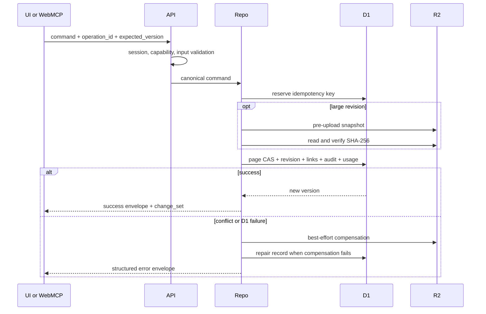
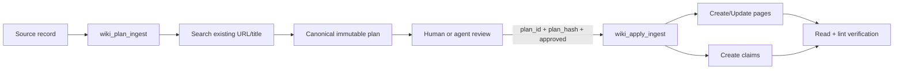

# Liminal Wiki System Design

> Status: Living design document for the implemented system
>
> Last integrated review: 2026-08-30
>
> Scope: `site`, `recovery-site`, page-scoped WebMCP, and the D1/R2 data layer
>
> Baseline deployment record: production Sites saved version 36
>
> License: `GPL-3.0-only`

## 1. Purpose and How to Read This Document

This document is the single system-design baseline required to understand and change Liminal Wiki. It defines the product intent, runtime boundaries, data model, API and WebMCP contracts, knowledge-ingestion flow, security, recovery, operations, and verification criteria in one place.

It does not describe past development phases or revision order. It presents the system as a single coherent design implemented by the current source. If the document and implementation differ, the running code and data migrations are the source of truth. Whoever identifies the discrepancy must update this document in the same change.

Command-level operational procedures live in [`site/RECOVERY_RUNBOOK.md`](../site/RECOVERY_RUNBOOK.md), while file-level origins and porting records live in [`docs/SOURCE_PROVENANCE.md`](SOURCE_PROVENANCE.md). Those files are an execution runbook and a license-provenance record respectively, not separate design documents that fragment the system design.

## 2. Product Definition and Scope

Liminal Wiki is a source-grounded Markdown knowledge workspace hosted on ChatGPT Sites. People read pages, evidence, topics, connections, and immutable history through the browser UI, then copy a structured change request to Codex. Codex and ChatGPT Work maintain content through WebMCP tools registered by the open Site. People continue to manage vault lifecycle, members, backups, and operational settings directly.

The system is responsible for:

- Managing multiple vaults and a per-user active vault
- Markdown source, folder/page hierarchy, frontmatter, wiki links, and graph data
- Source metadata, reviewable ingest plans, claim-level provenance, and wiki linting
- Optimistic concurrency, idempotency, immutable revisions, soft deletion, and recovery
- Consistency between D1 metadata and large R2 objects
- Portable export, full backup, and resumable restore into a blank Site
- Role-based UI/API/WebMCP permissions and an operational read-only mode
- Auditing, request/command/tool metrics, storage repair, and diagnostics

The following are intentionally outside the system:

- An independent remote MCP or background agent that continues running after the page closes
- Built-in LLM chat, provider configuration, Deep Research, or local CLI execution
- A vector database and semantic search
- Automatic merge import into an existing vault
- Real-time CRDT collaborative editing
- Organization billing and a general-purpose multi-tenant SaaS control plane
- A guarantee that a deleted Site can be recovered without an external full backup

## 3. Core Design Principles

1. **People request; agents maintain.** The product Site is a read-only knowledge surface whose structured request identifies and authorizes an exact scope. WebMCP executors use same-origin APIs and repository rules; administrative UI actions use those APIs only for vault, member, backup, and operational controls.
2. **The server is the final authorization boundary.** Hiding tools or disabling buttons is a UX measure; every API rechecks the session, capability, and vault membership.
3. **Every write makes conflicts and retries explicit.** Updates to existing objects use `expected_version`; replayable commands use `operation_id` and a canonical request hash.
4. **Markdown is the portable source of truth.** Link and frontmatter indexes are derived data. Source metadata and claims are preserved as separate structured data.
5. **Committed changes must be traceable and recoverable.** Updates create immutable revisions and audit events, while deletion is soft by default.
6. **D1/R2 non-atomicity is handled as a state machine.** The design explicitly uses pre-upload, checksums, conditional updates, compensating deletion, and a repair journal.
7. **Content read by an agent is not an instruction.** Markdown and evidence fragments are returned as untrusted content.
8. **WebMCP success is determined by real discovery and invocation.** The presence of `registerTool` in source or a successful build does not by itself prove runtime success.

## 4. System Context and Runtime Boundaries


WebMCP tools belong to the open page and its current login session. If the page closes, or navigation, login, or a vault switch changes capabilities, the tool set must be discovered again. This is not an always-available MCP server connected through a separate endpoint.

The human-facing UI must continue to work in a normal browser without WebMCP capability. Server APIs are not WebMCP-specific; the UI, WebMCP, and tests share them.

### 4.1 Deployment Units

- `site/`: source for the production Site. The D1 binding is `DB`, and the R2 binding is `FILES`.
- `recovery-site/`: deployment unit for blank-Site recovery and isolated performance verification.
- `skills/llm-wiki-domain/`: canonical Agent Skill that defines the source-grounded wiki workflow.
- `.agents/skills/llm-wiki-domain/`: thin entry point for Codex repository discovery.

The production and recovery Sites use separate data resources. A benchmark flag or fixture from the recovery Site must never propagate to production.

## 5. Components and Responsibilities

| Component               | Responsibilities                                                                                                     | Not responsible for                                               |
| ----------------------- | -------------------------------------------------------------------------------------------------------------------- | ----------------------------------------------------------------- |
| Workspace UI            | Vault switching, read-only tree/search/preview/graph, revision/attachment views, contextual requests, and operations | Content mutation, final server authorization, direct D1/R2 access |
| `SiteTools` adapter     | Capability lookup, conditional registration of 27 tools, input revalidation, same-origin calls, metrics              | Domain rules and persistence                                      |
| API routes              | Request envelope, session/capability checks, command invocation, HTTP status mapping                                 | UI state and agent workflow decisions                             |
| Wiki repository/domain  | Vault isolation, CAS, idempotency, and revision/link/claim/ingest/backup invariants                                  | WebMCP lifecycle                                                  |
| D1                      | Relational metadata, current Markdown, inline revisions, plans, claims, audit, metrics, state machines               | Large binaries and large revision bodies                          |
| R2                      | Attachments, large revision snapshots, import staging objects                                                        | Final authorization and referential checks                        |
| `llm-wiki-domain` Skill | Search-before-create, source preservation, plan-before-apply, provenance, post-apply verification                    | Security boundaries and server permissions                        |
| Operations center       | Read-only mode, members, audit, usage, repair, diagnostics, and benchmark execution                                  | Automatic external-backup scheduling                              |

## 6. Data Design

All knowledge data is isolated by vault through `wiki_id`. The server should determine the signed-in user's active vault instead of trusting an arbitrary vault ID supplied by a client.

### 6.1 Workspace and Session

| Table                   | Role                                       | Key invariant                                                     |
| ----------------------- | ------------------------------------------ | ----------------------------------------------------------------- |
| `wikis`                 | Vault identity, slug, title, lifecycle     | Stable UUID, unique slug, soft-delete state                       |
| `wiki_members`          | Per-vault `owner/editor/viewer` membership | Unique `(wiki_id, user_email)`; every active vault has an owner   |
| `wiki_user_preferences` | Per-user active vault                      | Only a vault of which the user is actually a member can be chosen |
| `site_state`            | Initial bootstrap reservation              | Singleton, version-CAS, `empty → reserved → active`               |
| `site_runtime_settings` | Operational write mode                     | Singleton; owner switches `read_write/read_only`                  |

For a new Site, only one authenticated bootstrap identity can acquire the CAS reservation and create the first vault. After bootstrap, an owner may create additional vaults, and each user's active vault is isolated through `wiki_user_preferences`.

### 6.2 Knowledge and Provenance

| Table                      | Role                                                     | Key invariant                                                                |
| -------------------------- | -------------------------------------------------------- | ---------------------------------------------------------------------------- |
| `pages`                    | Folders/pages and current Markdown                       | Unique sibling slug, monotonically increasing version, soft deletion         |
| `page_revisions`           | Immutable snapshots                                      | Unique `(page_id, version)`; consistent inline/R2 location and state         |
| `page_links`               | Link, backlink, and graph index derived from Markdown    | Source-vault isolation; duplicate titles remain unresolved                   |
| `wiki_operating_contracts` | Vault purpose, type, naming, provenance, approval policy | Version-CAS; version 0 is the server default                                 |
| `ingest_plans`             | Canonical review plan and apply progress                 | Actor/vault ownership, immutable `plan_hash`, expiry, resumable action state |
| `knowledge_claims`         | Claim-level provenance                                   | Exactly one object page/value; source, subject, and object share a vault     |

`pages.page_type` supports `folder`, `note`, `source`, `concept`, `entity`, `synthesis`, `comparison`, and `query`. A source page stores its URL, retrieval status/time, extraction method, and confidence in separate columns so lint and ingest do not have to infer them from Markdown strings.

### 6.3 Reliability and Storage Consistency

| Table              | Role                                         | Key invariant                                                          |
| ------------------ | -------------------------------------------- | ---------------------------------------------------------------------- |
| `attachments`      | R2 object metadata                           | Server-generated object key, checksum, explicit state transitions      |
| `idempotency_keys` | Mutation retry control                       | Unique `(wiki, actor, operation, operation_id)`; fixed request hash    |
| `wiki_usage`       | Logical D1/R2 usage                          | Bytes separated by store; reconcile drift before accepting more writes |
| `storage_repairs`  | Orphan/missing/pending-delete repair journal | Only safely abbreviated errors; retryable state is retained            |

Revisions of 64 KiB or less may remain inline in D1; larger snapshots use R2. For attachments and R2 revisions, neither a D1 row without its R2 object nor an R2 object without its D1 row is considered a successful result.

### 6.4 Portability and Recovery

| Table                      | Role                                       | Key invariant                                                                |
| -------------------------- | ------------------------------------------ | ---------------------------------------------------------------------------- |
| `import_sessions`          | Resumable blank-Site restore state         | Fixed actor and manifest hash; uses a staging vault                          |
| `import_manifests`         | Server-validated canonical manifest        | One per session                                                              |
| `import_batches`           | Expected/received hash for each part       | Unique `(session_id, batch_index)`; commit only after every part is verified |
| `backup_runs`              | Portable/full export lifecycle             | Manifest hash, part count, acknowledgment time                               |
| `backup_manifests`         | Canonical manifest at prepare time         | One per backup run                                                           |
| `backup_revision_coverage` | Proof of revisions included in full backup | Only an acknowledged full backup can justify pruning                         |

### 6.5 Audit and Metrics

| Table                      | Role                                                  | Never stores             |
| -------------------------- | ----------------------------------------------------- | ------------------------ |
| `audit_events`             | Actor, origin, action, target, outcome, request ID    | Body, cookies, tokens    |
| `webmcp_tool_metrics`      | Count and latency by tool/outcome                     | Tool input/result bodies |
| `api_request_metrics`      | Count and latency by command/outcome                  | URL arguments and body   |
| `api_command_measurements` | Bounded measures such as search count or upload bytes | Private payload          |

## 7. Core Command Flows

### 7.1 Session and Active Vault

1. The server reads the ChatGPT authentication identity and normalizes the email address.
2. It combines the active vault in `wiki_user_preferences` with the role in `wiki_members`.
3. It applies `site_runtime_settings` to produce a capability projection.
4. The UI and WebMCP registration use the same `/api/session/capabilities` response.
5. A vault switch rechecks membership and atomically updates the user preference.
6. When a role or capability changes, the caller refreshes UI state and WebMCP discovery.

### 7.2 Page Creation and Update



Key rules:

- Update, move, link, and restore use CAS equivalent to `WHERE id = ? AND wiki_id = ? AND version = expected_version`.
- Page, revision, link index, audit, and usage updates must succeed together in a D1 batch.
- A completed replay with the same operation and request hash returns the original result.
- A different payload under the same operation ID is rejected.
- An unexpired pending lease is not taken over. A retryable failure resumes only after confirming that no committed change occurred.
- Restoring a revision does not rewind history; it saves the selected snapshot as `current version + 1`.
- The `change_set` from a successful write updates the current tab immediately; other views converge on focus, navigation, or periodic refresh.

### 7.3 Tree, Links, and Graph

- A folder is also a Markdown index page and may contain child folders and pages.
- Sibling slugs must be unique, including at the root.
- A page cannot be moved under itself or one of its descendants.
- Only leaf pages can be soft-deleted, and restore does not overwrite a slug collision automatically.
- Wiki links are reparsed when Markdown is saved. `page_links` is never edited directly.
- `wiki_link_pages` modifies source Markdown through either `related_frontmatter` or `append_section`, then calls the shared page-update path.
- Duplicate titles are not linked to an arbitrary target; they remain unresolved with `target_page_id = null`.

### 7.4 Source-Grounded Ingest



The planning stage validates a source record, up to 20 proposed pages, and up to 100 claims. It searches existing source URLs and sibling titles to classify create versus update actions and pins the target version for each update. The server hashes the stored canonical plan with SHA-256 and does not trust client reconstruction.

Apply requires `plan_id`, the exact `plan_hash`, `approved: true`, and `operation_id`. Each action has a stable sub-operation ID and completion state, so execution can resume after interruption. Because a plan may span multiple pages and R2 revisions, the system does not claim cross-page all-or-nothing behavior. It exposes partial success through `applying` or `failed` state and preserves resume information.

Claims require a source page and a bounded evidence fragment. A claim whose `valid_to` has passed is retained as historical rather than deleted, and `supersedes_claim_id` records its evolution.

`wiki_lint` reports a bounded issue list for missing source metadata, unresolved links, orphans, sibling duplicates, source-less claims, expired claims, and low-confidence sources. Lint does not mutate the vault.

### 7.5 Attachments and R2 Revisions

The normal attachment state flow is `pending → ready → soft_deleted → deleting → deleted`, with failures recorded separately.

1. Create pending metadata in D1.
2. Upload to R2 using a server-generated key.
3. Read it back and verify its size and SHA-256.
4. Transition the D1 record to ready.
5. On failure, compensate by deleting the object or create a `storage_repairs` record.

A soft-deleted attachment remains recoverable for 30 days. Expiry purge creates a deleting reservation before deleting from R2 and finalizing D1. Active SVG, disallowed MIME types, quota overflow, and attachment IDs from another vault are rejected.

### 7.6 Export, Backup, and Blank-Site Restore

The system provides two export profiles:

- `portable`: current Markdown, hierarchy, link metadata, attachments, operating contract, and active claims
- `full`: portable content plus retained revisions and audit/backup metadata; it may provide revision-pruning coverage

A large export is composed of a manifest and numbered parts. The browser must verify every part's size and hash, then acknowledge the manifest hash and complete checksum list before `acknowledged_at` and revision coverage become valid. A portable export or a run for which only some parts were received cannot justify pruning.

Restore never overwrites the active vault. It creates a staging vault and import session in a blank Site, then validates:

- Archive path traversal, total capacity, part size, and attachment count
- Manifest schema and every part checksum
- Page, attachment, revision, and link UUIDs
- Revision count and page/version relationships
- Duplicate sibling slugs
- Frontmatter recalculated from canonical Markdown
- Whether every batch in `0..total_batches-1` is verified

Commit activates the verified staging vault and makes the current restore user its new owner. Even when explicitly included, the backup's member list is informational and is not restored as automatic authorization.

## 8. API and Result Contracts

The API exposes these route groups:

| Group          | Representative routes                                                                                                     | Role                                                                                  |
| -------------- | ------------------------------------------------------------------------------------------------------------------------- | ------------------------------------------------------------------------------------- |
| Session/Vault  | `/api/session/capabilities`, `/api/session/active-wiki`, `/api/wikis`, `/api/wikis/:wikiId`, `/api/wikis/:wikiId/restore` | Identity, capability, vault list/create/switch, owner-only 30-day soft delete/restore |
| Page/Revision  | `/api/pages`, `/api/pages/:id`, `/append`, `/move`, `/link`, `/revisions`, `/restore`                                     | Page lifecycle, CAS, revisions                                                        |
| Search/Graph   | `/api/search`, `/api/graph`, `/api/pages/:id/neighbors`                                                                   | Bounded discovery and graph                                                           |
| Knowledge      | `/api/wiki-contract`, `/api/ingest/plans`, `/apply`, `/api/claims`, `/api/wiki-lint`                                      | Operating policy, ingest, provenance, quality                                         |
| Attachment     | `/api/attachments`, `/api/attachments/:id`, `/restore`                                                                    | R2 upload/download/soft delete/restore                                                |
| Portability    | `/api/export/prepare`, `/stream`, `/ack`, `/api/import/sessions`                                                          | Multipart backup and resumable restore                                                |
| Administration | `/api/members`, `/transfer-ownership`, `/api/operations`, `/api/audit`                                                    | Owner controls and audit                                                              |
| Maintenance    | `/api/maintenance/write-mode`, `/storage`, `/diagnostics`, `/search-benchmark`                                            | Read-only mode, repair, isolated verification                                         |
| Telemetry      | `/api/telemetry/webmcp`                                                                                                   | Content-free WebMCP outcome and latency aggregation                                   |

A successful response uses this envelope:

```json
{
  "ok": true,
  "data": {},
  "request_id": "req_...",
  "change_set": null
}
```

Error responses use the closed error-code set `unauthenticated`, `forbidden`, `not_found`, `validation_error`, `version_conflict`, `idempotency_pending`, `quota_exceeded`, `retryable_storage_error`, and `internal_error`.

```json
{
  "ok": false,
  "error": {
    "code": "version_conflict",
    "message": "The page changed after it was read.",
    "retryable": false,
    "details": {
      "expected_version": 7,
      "current_version": 8
    }
  },
  "request_id": "req_..."
}
```

## 9. WebMCP Design

### 9.1 Registration Lifecycle

1. After the client component mounts, check for `document.modelContext.registerTool` support.
2. Read same-origin `/api/session/capabilities`.
3. Register only tools permitted by the capabilities.
4. Every top-level input schema is closed with `additionalProperties: false`.
5. The executor revalidates input and calls the same-origin API.
6. Use an abort signal to clean up duplicate registration on unmount or rerender.
7. Record only outcome and latency by tool; never log inputs, bodies, results, or authentication data.

### 9.2 Tool Catalog

The current catalog contains at most 27 tools. The number actually discovered depends on session capabilities.

| Area       | Tool                             | Required capability | Meaning                                                     |
| ---------- | -------------------------------- | ------------------- | ----------------------------------------------------------- |
| Context    | `wiki_get_context`               | `can_read`          | Current vault/page/selection/capabilities                   |
| Vault      | `wiki_list_vaults`               | `can_read`          | List accessible vaults                                      |
| Vault      | `wiki_switch_vault`              | `can_read`          | Change active vault and request rediscovery when needed     |
| Vault      | `wiki_create_vault`              | `can_create_wiki`   | Owner creates an independent vault                          |
| Policy     | `wiki_get_operating_contract`    | `can_read`          | Read the vault operating contract                           |
| Policy     | `wiki_update_operating_contract` | `can_write`         | Update the contract with version CAS                        |
| Browse     | `wiki_list_pages`                | `can_read`          | Partial hierarchy with cursor pagination                    |
| Browse     | `wiki_search`                    | `can_read`          | Title/body search with concise snippets                     |
| Browse     | `wiki_get_page`                  | `can_read`          | Bounded Markdown segment and version                        |
| Browse     | `wiki_get_neighbors`             | `can_read`          | Traverse nearby inbound/outbound links                      |
| Browse     | `wiki_list_revisions`            | `can_read`          | Revision metadata without snapshot bodies                   |
| Provenance | `wiki_get_claims`                | `can_read`          | List claims by subject/source                               |
| Insight    | `wiki_get_knowledge_map`         | `can_read`          | Read approved briefs, topics, evidence, and stale state     |
| Quality    | `wiki_lint`                      | `can_read`          | Bounded read-only quality audit                             |
| Ingest     | `wiki_plan_ingest`               | `can_write`         | Save an immutable review plan without changing wiki content |
| Ingest     | `wiki_apply_ingest`              | `can_write`         | Resume an approved plan whose hash matches                  |
| Insight    | `wiki_plan_knowledge_map`        | `can_write`         | Plan topic organization or approved insight briefs          |
| Insight    | `wiki_apply_knowledge_map`       | `can_write`         | Apply an unchanged authorized topic/insight plan            |
| Authoring  | `wiki_create_folder`             | `can_write`         | Create a Markdown index folder                              |
| Authoring  | `wiki_create_page`               | `can_write`         | Create page/source metadata                                 |
| Authoring  | `wiki_update_page`               | `can_write`         | Replace content using version CAS                           |
| Authoring  | `wiki_append_page`               | `can_write`         | Append at the end or to a named section                     |
| Authoring  | `wiki_move_page`                 | `can_write`         | Move after cycle/slug checks                                |
| Authoring  | `wiki_link_pages`                | `can_write`         | Create a link through Markdown                              |
| Recovery   | `wiki_restore_revision`          | `can_write`         | Restore an old snapshot as a new revision                   |
| Recovery   | `wiki_soft_delete_page`          | `can_soft_delete`   | Typed-confirmed, versioned leaf soft deletion               |
| Recovery   | `wiki_restore_deleted_page`      | `can_soft_delete`   | Recover a soft-deleted page with optional replacement slug  |

`wiki_plan_ingest` does not change pages or claims, but it does persist a review-plan row. Callers must therefore treat it as durable state in the analysis phase. `wiki_soft_delete_page` is registered only for a session with `can_soft_delete`, is annotated destructive and idempotent, and still rechecks that capability at the API boundary. It requires the current version, deletion reason, fresh operation UUID, and exact `DELETE {title}` confirmation.

### 9.3 Runtime Acceptance

A deployment is accepted in this order:

1. Open the exact deployment URL in a supported host.
2. Obtain the host's WebMCP capability.
3. Use `fetchTools()` to inspect name, description, schema, annotations, and origin.
4. Actually invoke `wiki_get_context` or `wiki_get_operating_contract`.
5. Verify create/update and a stale-version conflict on approved, recoverable data.
6. Rediscover after role, read-only mode, and vault changes to verify tool projection.

## 10. Authentication and Authorization

The server reads the Sites-provided authentication identity within the trust boundary and normalizes email to lowercase. It does not authorize based on a same-named header supplied arbitrarily by a client. Development identity fallbacks are forbidden in production.

| Operation                                             | Owner   | Editor  | Viewer  |
| ----------------------------------------------------- | ------- | ------- | ------- |
| Read vault/page/search/graph/claim/lint               | Allowed | Allowed | Allowed |
| Portable export                                       | Allowed | Allowed | Allowed |
| Create/update/append/move/link pages and folders      | Allowed | Allowed | Denied  |
| Restore revisions, manage attachments, delete/restore | Allowed | Allowed | Denied  |
| Update operating contract, apply ingest               | Allowed | Allowed | Denied  |
| Create a new vault                                    | Allowed | Denied  | Denied  |
| Manage members, roles, and ownership                  | Allowed | Denied  | Denied  |
| Full backup and blank-Site import                     | Allowed | Denied  | Denied  |

Operational `read_only` mode blocks content writes, restore, attachment mutation, soft deletion, import, bootstrap, and new-vault creation. Existing reads and portable export remain available. Owner member management and full backup remain separate capabilities for recovery and operations. The same policy is applied both to WebMCP discovery and direct API execution.

Every resource lookup combines `wiki_id` with a membership condition. Page, attachment, claim, and plan IDs from another vault are rejected without revealing whether they exist.

## 11. Security Design

| Threat                     | Design response                                                                               |
| -------------------------- | --------------------------------------------------------------------------------------------- |
| Cross-vault IDOR           | Server-derived active vault; vault condition on every repository query                        |
| Overwriting newer edits    | `expected_version` CAS, 409 conflict, agent re-read and scoped re-plan                        |
| Duplicate network retries  | Operation ID, request hash, lease, and stored replay result                                   |
| Markdown/KaTeX/Mermaid XSS | Restricted raw HTML, URL-scheme allowlist, sanitization, strict renderer settings             |
| Active file content        | MIME/extension/size limits; active SVG rejected                                               |
| Path traversal             | Server-generated R2 keys, slug/path normalization, import archive path validation             |
| Prompt injection           | Mark Markdown/evidence as `untrusted_wiki_content` and separate it from tool instructions     |
| Plan tampering             | SHA-256 of canonical server JSON, actor/vault/expiry checks, explicit approval                |
| R2/D1 inconsistency        | Checksums, state transitions, compensation, repair journal, missing-object guard              |
| Bootstrap race             | Singleton version-CAS reservation and lease recovery                                          |
| Partial backup loss        | Completed coverage is invalid until every part checksum and the manifest are acknowledged     |
| Secrets exposed in logs    | No headers/cookies/tokens/bodies/tool payloads; only fixed command names and safe error codes |

Responses apply CSP, `X-Content-Type-Options`, `Referrer-Policy`, and `Permissions-Policy`, and disable framework-identifying headers. Errors return a safe code and request ID instead of stack traces or raw storage/SQL messages.

## 12. Revision, Quota, and Retention Policy

- Each successful WebMCP write, import, and restore creates an immutable revision. Legacy API autosave revisions remain readable and retain their existing classification.
- Legacy autosave revisions retain all versions for 24 hours, the last version per hour through 30 days, and the last version per day through 180 days.
- Explicit/WebMCP/import/restore revisions are retained for 180 days.
- Regardless of policy, retain the latest 100 revisions per page and all pinned revisions.
- Keep no more than the latest 10 D1 inline snapshots per page; tier the remaining retained snapshots to R2.
- Before pruning, verify acknowledged full-backup coverage and pinned status.
- The D1 soft budget is 8 GiB with index/overhead headroom, and the operational R2 soft budget is 20 GiB.
- Warn at 70%, issue a strong warning at 85%, and at 95% block normal writes that increase the affected store.
- Export, cleanup, soft deletion, and maintenance remain available while writes are quota-blocked.
- If logical usage and verifiable physical usage differ by at least 5%, require reconciliation and do not permit writes based on the lower estimate.

## 13. UI and Provenance Boundaries

The product UI consists of a left icon rail; a read-only vault/folder/page tree and search; a central Markdown reader; topic insights; a graph; attachment downloads and history; a contextual change-request dialog; and operations surfaces. Panels become drawers on narrow screens. It provides keyboard navigation, accessible names, visible focus, reduced motion, and a list alternative to the graph.

The request dialog defaults to the current document, topic, revision, deleted page, or whole wiki and copies a localized prompt containing stable IDs, path, version, permalink, request type, user details, workflow rules, and exact-scope authorization. It never embeds the page body or persists a request row. Direct document editing, saving, moving, deletion, attachment upload, revision restoration, trash restoration, and folder drag/drop are absent from `site/`. Periodic refresh on a non-document surface must not arbitrarily return the user's current view to a document. For overlapping workspace requests, only the latest response is applied.

`recovery-site/` is an explicit operational exception. It retains direct disaster-recovery and verification controls and does not adopt the human-facing request workflow.

Pinned origins, file-level mappings, changes, exclusions, and license treatment for externally ported or adapted UI code and interaction patterns are managed solely in [`docs/SOURCE_PROVENANCE.md`](SOURCE_PROVENANCE.md). Validation covers `LICENSE`, each Site's `THIRD_PARTY_NOTICES.md`, and that provenance record together.

## 14. Operations and Observability

The operations view provides:

- Owner role management and atomic ownership transfer
- Write-mode switching with a recorded reason
- Recent audit events with human/WebMCP/import/system origin
- Logical D1/R2 usage, repair queue, and retention/purge execution
- Success/denied/conflict/validation/error counts and latency by command
- Count/latency by WebMCP tool, search-result counts, and actual R2 upload bytes
- Bounded diagnostics and explicitly enabled isolated benchmarks

Migrations are append-only. Deployed SQL files are never modified, and destructive schema changes are split across expand/migrate/contract deployments. Application rollback and database rollback are not assumed to be the same operation.

Deployment follows this order:

1. Pin the source artifact and migration set to deploy.
2. Pass static checks, tests, build, backup round trip, and supply-chain gates.
3. If the schema changes, manually review the generated append-only migration.
4. Before risky data changes, verify a recent external full backup or recoverable snapshot.
5. Save a Sites version and deploy to a restricted environment while preserving the existing access policy.
6. Verify UI smoke tests, session capabilities, and D1/R2 persistence.
7. On the same deployment version, perform WebMCP discovery and a harmless read call.
8. Verify writes and conflicts on approved, recoverable data before expanding access.

Incident response follows this priority:

1. Use operational read-only mode to stop risky writes.
2. Use request IDs and audit/metrics to identify the failure scope.
3. If the issue is an application regression, roll back to the previous Sites version.
4. For page issues, use revision or soft-delete restore.
5. Handle R2 inconsistencies through reconciliation and the repair queue.
6. For total Site loss, restore an external full backup into a new owner-only Site.

Recovery objectives:

- In-Site page issue: recover through the latest committed revision, target RTO 30 minutes
- Total Site loss: recover through the latest external full backup, target RTO four hours after a new Site is ready
- Pilot full-backup objective: every seven days, with a warning when overdue

## 15. Quality and Verification Strategy

### 15.1 Automated Gates

Every change must pass the applicable subset of:

- Formatting, ESLint, and TypeScript typecheck
- Vitest unit and contract tests
- Drizzle migration check and append-only review
- Production build and bundle-regression budget
- Direct runtime dependency audit and notices-drift gate
- Playwright UI smoke/lifecycle, keyboard, reduced-motion, and serious/critical axe checks
- D1 batch atomicity, CAS race, role/IDOR, XSS, active SVG, and import traversal/limit checks
- Portable/full backup round trip and checksums
- 10,000-page search/read/tree benchmark
- Post-deployment WebMCP `fetchTools()` and a harmless real call

### 15.2 Performance Budgets

| Metric             |                                       Budget |
| ------------------ | -------------------------------------------: |
| Warm shell         |                            p75 at most 2.5 s |
| Page read          |                           p95 at most 300 ms |
| Page save          |                           p95 at most 500 ms |
| 10,000-page search |                    server p95 at most 500 ms |
| Initial tree       |         At most 500 nodes, or use pagination |
| Initial graph      |                          At most 2,000 nodes |
| Page Markdown      |                      256 KiB default maximum |
| Import part        | 512 KiB max; at most 8 R2 objects per commit |
| Active attachments |                                  At most 200 |

End-to-end WebMCP time includes the host and browser relay, so it is measured separately from server-handler latency.

## 16. Current Verification Snapshot and Residual Risks

This section records acceptance evidence as of 2026-08-30, not design requirements. It must be remeasured over time and does not automatically guarantee the latest operational state.

### 16.1 Verified State

- The Sites source artifact `bde05e9ede88353ee4043f03d6c0d2e0e5ebb15a`, including the source-grounded workflow, was recorded as deployed to production in saved version 36.
- The accepted deployment used a custom owner-only access policy. Its generated Site URL is intentionally not part of the reusable source or design contract.
- Production retained custom owner-only access, and WebMCP capability, tool discovery, and real calls to `wiki_get_operating_contract`, `wiki_lint`, and `wiki_get_context` succeeded in the owner session.
- The current tool catalog contains at most 27 tools. Historical 12- and 22-tool verifications predate the current insight and recoverable-delete tools and must not be used as the baseline for the current catalog.
- For the source-grounded change baseline, formatting, lint, typecheck, database checks, build, notices, bundle gates, and 12 Vitest files with 63 tests were recorded as passing.
- UI smoke/lifecycle, backup round trip, blank-Site import, contract update, a three-action ingest plan/apply, idempotent replay, claims, and negative plan checks passed.
- The isolated recovery Site's 10,000-page measurements were search p95 190 ms, page-read p95 175 ms, and initial-tree p95 1,180 ms for 200 nodes; only the original page remained after fixture cleanup.
- The 100 MiB/203-part restore spike completed through 26 resumable commits with coordinator peak RSS of 79 MiB.
- No unresolved P0/P1 issue remained within the engineering security review and automation scope, and zero production dependency vulnerabilities were recorded.

### 16.2 Preserved Recovery Evidence

- Production full-backup acceptance file: `.backups/liminal-wiki-production-full-2026-08-30.zip`, 29,011 bytes, SHA-256 `1f22e2617f497b646ac7e28c206ea5ae12eed7a8b1df7373d5f02108aa057672`
- At verification time, that package matched size/hash and server acknowledgment/coverage for 2 pages, 3 retained revisions, 1 attachment, and 5 parts.
- Hosted restore fixture: `.backups/liminal-wiki-hosted-restore-fixture.zip`, 5,741 bytes, SHA-256 `688cae7097c67d9f60818a8e25feee1f9dce3567fceb5bf489a90cd43ac81c02`
- The recovery Site verified 4/4 fixture batch hashes, page v2, 2 revisions, a 39-byte attachment and checksum, a new owner, and a WebMCP read call after redeployment.

These files are acceptance evidence, not a claim that they are the latest full backup of current production. Operators must periodically create backups containing newer data and update their separately retained locations and checksums.

### 16.3 Open Gates

- Verify the discovery and execution permission matrix with actual hosted editor and viewer accounts
- Verify the current 27-tool catalog's search/create/update and capability-gated deletion flow in a ChatGPT Work host
- Obtain an independent security reviewer's sign-off
- Backfill 30 source-metadata records in the existing production vault
- Resolve the three currently known unresolved wiki links: `[[아키텍처]]`, `[[도구 계약]]`, `[[운영과 복구]]`
- Verify adherence to the external full-backup schedule with current production data

The successful owner-hosted acceptance must not be interpreted as organization-wide deployment readiness that includes these open gates.

## 17. Change Rules and Decision Record

The following decisions are system defaults. Any change to them must update both the code and this document:

- The product name is Liminal Wiki, the license is `GPL-3.0-only`, and no third-party branding is used.
- WebMCP is a page-scoped integration and is not presented as an independent remote MCP.
- The human UI and agent tools share the same API, domain, and data layers.
- Multiple vaults are supported, but each request addresses one server-derived active vault.
- Markdown and structured provenance are preserved together.
- Source ingest follows search → immutable plan → explicit approval → resumable apply → verification.
- Mutations never bypass CAS or idempotency.
- Recovery from total Site loss assumes a full backup stored outside Sites.
- Destructive WebMCP tools are exposed only when target, impact, recoverability, capability gating, idempotency, and typed-confirmation contracts are enforced by both schema and server.

A pull request that changes the design must answer at least:

1. Do the UI and WebMCP still use the same commands?
2. Are role, read-only, and vault-isolation policies preserved in both discovery and execution?
3. Are CAS, idempotency, revision, and audit invariants preserved?
4. Can an intermediate D1/R2 failure silently create orphaned or missing data?
5. Are export/import and previous-package compatibility preserved?
6. Was WebMCP verified through real host discovery and a harmless call?
7. Can operators and readers understand the new design from this document alone?

## 18. References

- OpenAI Sites: <https://learn.chatgpt.com/docs/sites>
- OpenAI WebMCP: <https://learn.chatgpt.com/docs/webmcp>
- Source provenance: [`docs/SOURCE_PROVENANCE.md`](SOURCE_PROVENANCE.md)
- Runtime package and validation commands: [`site/package.json`](../site/package.json)
- Recovery procedure: [`site/RECOVERY_RUNBOOK.md`](../site/RECOVERY_RUNBOOK.md)
- Domain workflow: [`skills/llm-wiki-domain/SKILL.md`](../skills/llm-wiki-domain/SKILL.md)
