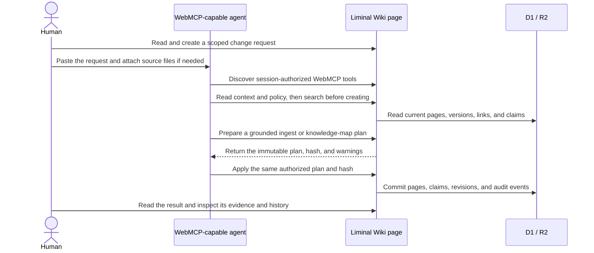
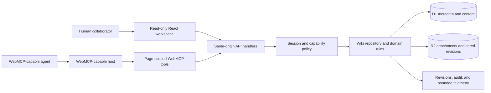

# Liminal Wiki technical guide

This document contains the implementation, security, operational, and
validation details that were previously embedded in the project README. For the
product idea and the shortest path to using Liminal Wiki, start with the
[main README](../README.md).

## Access, isolation, and ownership

ChatGPT sign-in is mandatory. On the first signed-in visit, an account with no
existing membership receives an isolated `Liminal Wiki` and becomes its owner.
Returning with the same account reopens that wiki. Another account receives a
different wiki and cannot discover the first account's content.

The public URL exposes only the ChatGPT sign-in boundary. Wiki access comes
from the signed-in account's membership; it does not grant anonymous or
cross-vault access. There is no temporary trial mode. Personal wikis use the
same persistent storage, role model, revisions, provenance, backup, recovery,
and WebMCP surface as other production wikis.

Restricted isolated workspaces created under the earlier access policy are
upgraded in place to personal owner vaults on their next signed-in session,
retaining their pages and revision history.

### Shared wikis and roles

An owner may add another ChatGPT account under **Settings & backup → People &
access** by entering the email address associated with that account and
assigning `editor` or `viewer`. This creates a membership for that wiki only.
It does not publish the wiki or replace either person's personal wiki.

No invitation email is sent. The added person opens the Site, signs in with the
matching ChatGPT account, and selects the shared wiki from the wiki switcher.

| Role     | Access                                                                                         |
| -------- | ---------------------------------------------------------------------------------------------- |
| `viewer` | Read pages, connections, revisions, attachments, and standard exports                          |
| `editor` | Viewer access plus page changes, revision restore, attachments, and recoverable content delete |
| `owner`  | Editor access plus members, ownership transfer, full backup/import, and operations             |

Only the current owner can add or remove members, change roles, or transfer
ownership. Member administration remains a human-facing operation and is not
part of the page-scoped WebMCP catalog.

## Product boundary

The human-facing Site is intentionally read-only for routine knowledge work.
It offers:

| Screen                | Purpose                                                                          |
| --------------------- | -------------------------------------------------------------------------------- |
| **Documents**         | Read a page and create a contextual change request                               |
| **Explore topics**    | Read approved conclusions, tensions, implications, questions, and their evidence |
| **Find**              | Find pages by title or content                                                   |
| **Connections**       | Explore page relationships                                                       |
| **Settings & backup** | Manage wikis, people, backups, storage, and operational settings                 |

The normal Site does not provide direct page editing, save or autosave,
folder drag-and-drop, content deletion, attachment upload, revision restore,
or trash restore controls. People create a structured request from the current
wiki, page, topic, revision, or deleted-page context. A WebMCP-capable agent
performs routine knowledge changes through the page-scoped tools.

Membership, ownership transfer, backup/import, operational settings, and wiki
deletion stay human-facing. A session with `can_create_wiki` may also expose
`wiki_create_vault` without granting membership or bypassing owner controls.
The separate recovery Site is an explicit disaster-recovery surface.
Therefore, “WebMCP is the normal write path” refers to routine knowledge
changes, not every administrative or recovery operation in the product.

## Structured change requests

A generated request carries:

- the target wiki and stable target ID;
- the current page version and permalink when applicable;
- the request type and the person's instructions;
- explicit authorization for that exact scope;
- the required inspect, plan, apply, and reporting workflow.

The Site copies the request into the person's agent conversation. It does not
store a parallel request record or copy the page body into the prompt. The
agent reads the live state through WebMCP. If the target is ambiguous, the
required scope expands, the version changes, or warnings reveal a wider impact,
the agent must stop and return to the person.

## Human–agent collaboration loop



A representative grounded flow is:

1. `wiki_get_context` and `wiki_get_operating_contract` establish the active
   vault, permissions, and policy.
2. `wiki_search`, `wiki_get_page`, `wiki_get_neighbors`,
   `wiki_get_claims`, and `wiki_get_knowledge_map` inspect existing knowledge
   before creation.
3. `wiki_plan_ingest` or `wiki_plan_knowledge_map` stores an immutable,
   expiring review plan.
4. The agent checks that the plan and warnings remain within the structured
   request's authorization.
5. The matching apply tool receives the unchanged plan hash, explicit
   `approved: true`, and a fresh operation ID. Ingest page versions are captured
   in the immutable plan and rechecked during apply.
6. Revisions, claims, and `wiki_lint` provide post-apply verification.

## Why page-scoped WebMCP

Liminal Wiki does not ask an agent to infer actions from screenshots or use a
separate automation identity. The open Site registers tools for its current
vault, selected page, signed-in role, capabilities, and operational mode.
Closing the page, switching vaults, or changing permissions can change the
available catalog.

This is not an independently available remote MCP server. The WebMCP surface
is page-scoped and deliberately uses the Site's current origin and session.
The product contract is not tied to one agent: a compatible host may discover
and call the tools exposed to its signed-in session.

| Conventional automation risk            | Liminal Wiki contract                                  |
| --------------------------------------- | ------------------------------------------------------ |
| Infer actions from DOM or screenshots   | Discover closed, typed page actions                    |
| Maintain a separate automation identity | Reuse the signed-in Site session and role              |
| Write against stale content             | Require the latest `expected_version`                  |
| Duplicate work during retries           | Use retry-safe `operation_id` values                   |
| Generate prose without durable evidence | Store source metadata and claim-level provenance       |
| Hide changes in an agent transcript     | Commit immutable revisions and bounded audit events    |
| Offer every action to every session     | Project the catalog from current capabilities and mode |

## WebMCP surface

The exact catalog changes with the current session. Viewer and operational
read-only sessions discover no content-changing tools.

| Area                 | Representative tools                                                                                                  |
| -------------------- | --------------------------------------------------------------------------------------------------------------------- |
| Context and vaults   | `wiki_get_context`, `wiki_list_vaults`, `wiki_switch_vault`, `wiki_create_vault`                                      |
| Policy and grounding | `wiki_get_operating_contract`, `wiki_get_claims`, `wiki_lint`, `wiki_plan_ingest`, `wiki_apply_ingest`                |
| Topics and insights  | `wiki_get_knowledge_map`, `wiki_plan_knowledge_map`, `wiki_apply_knowledge_map`                                       |
| Browse               | `wiki_list_pages`, `wiki_search`, `wiki_get_page`, `wiki_get_neighbors`, `wiki_list_revisions`                        |
| Maintain             | `wiki_create_folder`, `wiki_create_page`, `wiki_update_page`, `wiki_append_page`, `wiki_move_page`, `wiki_link_pages` |
| Recover              | `wiki_restore_revision`, `wiki_soft_delete_page`, `wiki_restore_deleted_page`                                         |

`wiki_soft_delete_page` is available only with `can_soft_delete`. It requires
the current page version, a reason, a retry-safe operation ID, and the exact
`DELETE {title}` confirmation after children and evidence impact are checked.

## Safety properties

- **Capability-aware discovery:** the page registers only tools supported by
  trusted same-origin session capabilities.
- **Server-side authorization:** every API handler independently rechecks the
  vault and permission boundary.
- **Closed and bounded inputs:** schemas reject unknown fields and constrain
  sizes and counts; executors validate again before calling an API.
- **Optimistic concurrency:** existing-page writes require
  `expected_version`.
- **Safe retries:** mutations use client-generated operation UUIDs where the
  contract promises idempotency.
- **Plan before apply:** grounded ingest and knowledge-map work separate review
  from hash-matched application.
- **Recoverable history:** successful changes create immutable revisions;
  restoration creates a new latest revision instead of rewinding history.
- **Untrusted content boundary:** wiki Markdown and evidence fragments are
  returned as content, never as agent instructions.
- **Content-free telemetry:** WebMCP observability records bounded outcomes,
  latency, tool names, and safe correlation data—not prompts, page bodies,
  credentials, or results.
- **Operational containment:** owner-controlled read-only mode hides mutation
  tools, disables change requests, and rejects mutation APIs.

## Workspace capabilities

The human interface and WebMCP tools operate on the same product rather than on
parallel copies. The workspace includes:

- multiple wikis with folder/page hierarchy and per-user switching;
- read-only Markdown rendering with GFM, math, Mermaid, wikilinks, stable
  permalinks, and contextual change requests in four languages;
- isolated full-text search, backlinks, and theme-aware,
  keyboard-accessible connection exploration;
- source pages, structured retrieval metadata, claim-level provenance, and
  knowledge-quality linting;
- approved topic outlines and evidence-backed insight briefs;
- immutable revisions, restore-as-new-version, requested leaf soft delete,
  and trash recovery;
- attachment viewing and download in the human UI, plus grounded ingestion
  from files attached to the agent conversation;
- portable and full multipart backups with per-part SHA-256 and resumable
  empty-Site restore;
- member roles, ownership transfer, audit history, repair diagnostics, storage
  maintenance, and operational read-only mode.

## Architecture



The mounted client registers tools with
`document.modelContext.registerTool()`, projects descriptors from the current
capabilities, validates executor inputs, calls the product's same-origin
handlers, and cleans registrations with an abort signal.

## Technology

| Layer             | Choice                                                        |
| ----------------- | ------------------------------------------------------------- |
| Hosting           | ChatGPT Sites                                                 |
| Runtime           | Next.js-compatible vinext on Vite and Cloudflare Workers      |
| UI                | React 19, Base UI, Sigma/Graphology, Mermaid, KaTeX           |
| Data              | Cloudflare D1 through Drizzle ORM                             |
| Objects           | Cloudflare R2                                                 |
| Agent integration | Page-scoped WebMCP via `document.modelContext.registerTool()` |
| Validation        | TypeScript, ESLint, Prettier, Vitest, Playwright, axe-core    |

## Run locally

Requirements: Node.js 22.13 or newer and npm.

```bash
git clone https://github.com/rca32/llmwiki-webmcp.git
cd llmwiki-webmcp/site
npm ci
npm run dev
```

The ChatGPT Sites development runtime supplies local D1/R2 bindings and a test
identity. Production does not accept the local identity adapter. See
[`site/.env.example`](../site/.env.example) for the local configuration
surface.

## Validation

Static contracts and the production build:

```bash
cd site
npm run format:check
npm run lint
npm run typecheck
npm test
npm run test:notices
npm run db:check
npm run build
npm run test:bundle
```

Browser, scale, and recovery gates:

```bash
npm run test:ui:ci
npm run test:performance:ci
npm run test:backup-roundtrip
npm run test:backup-spike
```

WebMCP acceptance remains a host-level step. A build and the presence of
registration code are not sufficient:

1. Open the current deployment URL in a supported WebMCP-capable browser host.
2. Acquire the page's WebMCP capability and call `fetchTools()`.
3. Inspect discovered names, descriptions, schemas, annotations, and origin.
4. Call a harmless read tool such as `wiki_get_context`.
5. Rediscover after a role, vault, login, or operational-mode change.

## Repository map

```text
.
├── site/                         # Production ChatGPT Site
│   ├── app/site-tools.tsx        # WebMCP descriptors and executors
│   ├── app/api/                  # Same-origin command/query surface
│   ├── db/                       # D1 schema and repository invariants
│   ├── lib/                      # Contracts, validation, and safety
│   └── tests/                    # Browser, performance, bundle, and DR gates
├── recovery-site/                # Isolated recovery validation Site
├── skills/llm-wiki-domain/       # Source-grounded wiki Agent Skill
└── docs/
    ├── SYSTEM_DESIGN.md           # Architecture and acceptance evidence
    ├── SOURCE_PROVENANCE.md       # Origins, adaptations, and licenses
    └── WEBMCP_CHALLENGE.md        # Submission copy and demo script
```

## Related documentation

- [System design](SYSTEM_DESIGN.md)
- [WebMCP Challenge submission and demo script](WEBMCP_CHALLENGE.md)
- [Production Site guide](../site/README.md)
- [Recovery runbook](../site/RECOVERY_RUNBOOK.md)
- [Source provenance](SOURCE_PROVENANCE.md)

## License and provenance

Except where a file or third-party notice states otherwise, original Liminal
Wiki source and repository-owned modifications are licensed under
[`GPL-3.0-only`](../LICENSE). Third-party dependencies and separately
attributed works retain their licenses. See [source provenance](SOURCE_PROVENANCE.md)
and [third-party notices](../site/THIRD_PARTY_NOTICES.md).
